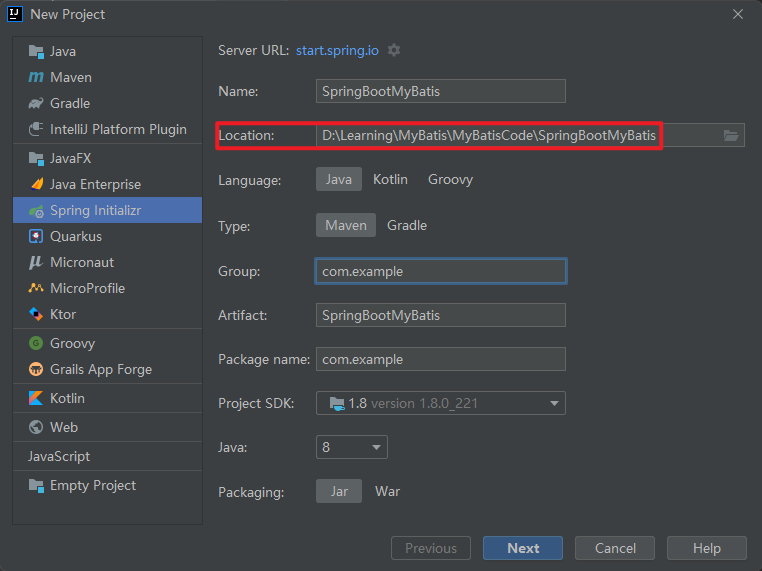
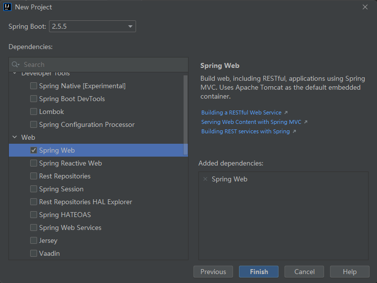

# 初始化环境

## 创建项目






## 添加依赖

```xml
<properties>
    <java.version>1.8</java.version>
    <!-- 可在此处设置MySQL驱动，修改父工程管理依赖的版本
    <mysql.version>8.0.xx</mysql.version>
    -->
</properties>

<dependencies>
    <!-- SpringBoot框架Web项目起步依赖 -->
    <dependency>
        <groupId>org.springframework.boot</groupId>
        <artifactId>spring-boot-starter-web</artifactId>
    </dependency>

    <!-- MySQL驱动 -->
    <dependency>
        <groupId>mysql</groupId>
        <artifactId>mysql-connector-java</artifactId>
    </dependency>

    <!-- MyBatis整合SpringBoot的起步依赖 -->
    <dependency>
        <groupId>org.mybatis.spring.boot</groupId>
        <artifactId>mybatis-spring-boot-starter</artifactId>
        <version>2.2.0</version>
    </dependency>
</dependencies>
```

## 逆向工程

使用MyBatis提供的逆向工程，生成实体Bean、映射文件、Dao接口。

### 创建表

```mysql
drop table if exists t_student;
create table t_student 
(
   id          int(10)           not null auto_increment,
   name     varchar(20)   null,
   age        int(10)           null,
   constraint PK_T_STUDENT primary key clustered (id)
);
 
insert into t_student(name, age) values("zhangsan", 25);
insert into t_student(name, age) values("lisi", 28);
insert into t_student(name, age) values("wangwu", 23);
insert into t_student(name, age) values("Tom", 21);
insert into t_student(name, age) values("Jck", 55);
insert into t_student(name, age) values("Lucy", 27);
insert into t_student(name, age) values("zhaoliu", 75);
```

### 逆向工程配置文件

拷贝Mybatis逆向工程配置文件到项目的根目录下：`GeneratorMapper.xml`，修改配置文件。

在`pom.xml`文件中添加Mybatis逆向工程：

```xml
<build>
    <plugins>
        <!-- SpringBoot项目编译打包插件 -->
        <plugin>
            <groupId>org.springframework.boot</groupId>
            <artifactId>spring-boot-maven-plugin</artifactId>
        </plugin>

        <!--Mybatis代码自动生成插件-->
        <plugin>
            <groupId>org.mybatis.generator</groupId>
            <artifactId>mybatis-generator-maven-plugin</artifactId>
            <version>1.3.7</version>
            <configuration>
                <!--配置文件的位置-->
                <configurationFile>GeneratorMapper.xml</configurationFile>
                <verbose>true</verbose>
                <overwrite>true</overwrite>
            </configuration>
        </plugin>
    </plugins>
</build>
```

运行文件：


### 实体类

```java
package com.example.entity;

/**
 * @author chenzufeng
 * 实体类
 */
public class Student {
    private Integer id;

    private String name;

    private Integer age;

    // Getter & Setter
}
```

### dao 层

```java
package com.example.dao;

import com.example.entity.Student;

/**
 * @author chenzufeng
 */
public interface StudentDao {
    /**
     * 根据主键删除
     * @param id 主键
     * @return 删除的数据主键
     */
    int deleteByPrimaryKey(Integer id);

    /**
     * 插入一条记录
     * @param record Student
     * @return
     */
    int insert(Student record);

    /**
     * 插入一条记录（字段可选）
     * @param record Student
     * @return
     */
    int insertSelective(Student record);

    /**
     * 根据主键查询
     * @param id 主键
     * @return
     */
    Student selectByPrimaryKey(Integer id);

    /**
     * 更新一条记录（字段可选）
     * @param record Student
     * @return
     */
    int updateByPrimaryKeySelective(Student record);

    /**
     * 根据主键跟新记录
     * @param record Student
     * @return
     */
    int updateByPrimaryKey(Student record);
}
```

### mapper.xml

```xml
<?xml version="1.0" encoding="UTF-8"?>
<!DOCTYPE mapper PUBLIC "-//mybatis.org//DTD Mapper 3.0//EN" "http://mybatis.org/dtd/mybatis-3-mapper.dtd">
<mapper namespace="com.example.dao.StudentDao">

  <!--
    自己组装一个结果集并返回一个结果集
    1. 当【数据库中字段名称】与【实体类对象的属性名】不一致时，可以进行转换
    2. 当前查询的结果没有对应一个表时，可以自定义一个结果集
  -->
  <resultMap id="BaseResultMap" type="com.example.entity.Student">
    <!-- id：标识主键字段；
          column：数据库中的字段名称（user_name）
          property：映射对象（实体对象）的属性名称（userName）
          jdbcType：数据库中字段类型（可省略）
     -->
    <id column="id" jdbcType="INTEGER" property="id" />
    <!-- 除了主键以外的数据库中字段名称 -->
    <result column="name" jdbcType="VARCHAR" property="name" />
    <result column="age" jdbcType="INTEGER" property="age" />
  </resultMap>

  <!-- sql语句片段，将公共的部分抽取出来，不用写select *影响效率 -->
  <sql id="Base_Column_List">
    id, name, age
  </sql>

  <select id="selectByPrimaryKey" parameterType="java.lang.Integer" resultMap="BaseResultMap">
    select
    <include refid="Base_Column_List" />
    from t_student
    where id = #{id, jdbcType=INTEGER}
  </select>

  <delete id="deleteByPrimaryKey" parameterType="java.lang.Integer">
    delete from t_student
    where id = #{id, jdbcType=INTEGER}
  </delete>

  <!-- 需要对每一个字段进行赋值 -->
  <insert id="insert" parameterType="com.example.entity.Student">
    insert into t_student (id, name, age)
    values (#{id, jdbcType=INTEGER}, #{name, jdbcType=VARCHAR}, #{age, jdbcType=INTEGER})
  </insert>

  <!-- 选择性插入 -->
  <insert id="insertSelective" parameterType="com.example.entity.Student">
    insert into t_student
    <!-- suffixOverrides="," 去除多余的逗号-->
    <trim prefix="(" suffix=")" suffixOverrides=",">
        <!-- 使用的封装类型，规避了"id != ''"空字符串的判断 -->
        <if test="id != null">
          id,
        </if>

        <if test="name != null">
          name,
        </if>

        <if test="age != null">
          age,
        </if>
    </trim>

    <trim prefix="values (" suffix=")" suffixOverrides=",">
      <if test="id != null">
        #{id, jdbcType=INTEGER},
      </if>

      <if test="name != null">
        #{name, jdbcType=VARCHAR},
      </if>

      <if test="age != null">
        #{age, jdbcType=INTEGER},
      </if>
    </trim>
  </insert>

  <update id="updateByPrimaryKeySelective" parameterType="com.example.entity.Student">
    update t_student
    <set>
      <if test="name != null">
        name = #{name, jdbcType=VARCHAR},
      </if>

      <if test="age != null">
        age = #{age, jdbcType=INTEGER},
      </if>
    </set>
    where id = #{id, jdbcType=INTEGER}
  </update>

  <update id="updateByPrimaryKey" parameterType="com.example.entity.Student">
    update t_student
    set name = #{name, jdbcType=VARCHAR}, age = #{age, jdbcType=INTEGER}
    where id = #{id, jdbcType=INTEGER}
  </update>
</mapper>
```


# 完善项目结构


## 添加controller层

```java
package com.example.controller;

import com.example.entity.Student;
import com.example.service.StudentService;
import org.springframework.beans.factory.annotation.Autowired;
import org.springframework.web.bind.annotation.GetMapping;
import org.springframework.web.bind.annotation.RequestMapping;
import org.springframework.web.bind.annotation.RestController;

/**
 * @author chenzufeng
 * @date 2021/10/17
 * @usage StudentController
 */
@RestController
@RequestMapping("/student")
public class StudentController {
    /**
     * 注入业务层
     * 如果没有在容器中注入StudentServiceImpl会报错：
     * No beans of 'StudentService' type found.
     */
    @Autowired
    private StudentService studentService;

    @GetMapping("/studentInfo")
    public Student getStudentInfo(Integer id) {
        Student student = studentService.queryStudentById(id);
        return student;
    }
}
```

## 创建业务service层

```java
package com.example.service;

import com.example.entity.Student;

/**
 * @author chenzufeng
 * @date 2021/10/17
 * @usage StudentService
 */
public interface StudentService {
    /**
     * 根据id查询学生信息
     * @param id 主键id
     * @return
     */
    Student queryStudentById(Integer id);
}

package com.example.service.impl;

import com.example.dao.StudentDao;
import com.example.entity.Student;
import com.example.service.StudentService;
import org.springframework.beans.factory.annotation.Autowired;
import org.springframework.stereotype.Service;

/**
 * @author chenzufeng
 * @date 2021/10/17
 * @usage StudentServiceImpl
 * @Service 将StudentServiceImpl注册到容器中供使用
 */
@Service
public class StudentServiceImpl implements StudentService {
    /**
     * 注入dao层，如果没有在容器中注入会报错：
     * No beans of 'StudentDao' type found.
     */
    @Autowired
    private StudentDao studentDao;

    @Override
    public Student queryStudentById(Integer id) {
        Student student = studentDao.selectByPrimaryKey(id);
        return student;
    }
}
```

## 将dao层注入容器

```java
package com.example.dao;

import com.example.entity.Student;
import org.apache.ibatis.annotations.Mapper;

/**
 * @author chenzufeng
 * @Mapper 扫描StudentDao接口到容器
 */
@Mapper
public interface StudentDao {
    // ......
}
```

## 连接数据库及mapper文件的配置

```properties
# 连接数据的配置
spring.datasource.driver-class-name=com.mysql.cj.jdbc.Driver
spring.datasource.url=jdbc:mysql://localhost:3306/springboot_mybatis?useSSL=false&serverTimezone=Asia/Shanghai&characterEncoding=utf-8&autoReconnect=true
spring.datasource.username=root
spring.datasource.password=120618

# 指定MyBatis映射文件的路径
mybatis.mapper-locations=classpath:mapper/*.xml
```

如果没有在配置文件中指定MyBatis文件映射文件的路径，调用接口时，会报错：

```markdown
org.apache.ibatis.binding.BindingException: Invalid bound statement (not found): com.example.dao.StudentDao.selectByPrimaryKey
```


## 启动入口类

- `@Mapper`：需要在每一个Dao接口类上添加，用于扫描Dao接口；
- `@MapperScan`：在SpringBoot启动入口类上添加，扫描所有dao包下接口。

```java
package com.example;

import org.mybatis.spring.annotation.MapperScan;
import org.springframework.boot.SpringApplication;
import org.springframework.boot.autoconfigure.SpringBootApplication;

/**
 * @author chenzufeng
 * @SpringBootApplication 开启Spring配置，扫描所有注解
 * @MapperScan(basePackages = "com.example.dao")：不用在每一个dao文件中添加@Mapper
 */
@SpringBootApplication
public class SpringBootMyBatisApplication {
    public static void main(String[] args) {
        SpringApplication.run(SpringBootMyBatisApplication.class, args);
    }
}
```


# 引入Swagger

## 引入Swagger依赖

```xml
<!-- https://mvnrepository.com/artifact/io.springfox/springfox-swagger2 -->
<dependency>
    <groupId>io.springfox</groupId>
    <artifactId>springfox-swagger2</artifactId>
    <version>2.9.2</version>
</dependency>

<!-- https://mvnrepository.com/artifact/io.springfox/springfox-swagger-ui -->
<dependency>
    <groupId>io.springfox</groupId>
    <artifactId>springfox-swagger-ui</artifactId>
    <version>2.9.2</version>
</dependency>

<!-- https://mvnrepository.com/artifact/com.github.xiaoymin/knife4j-spring-boot-starter -->
<dependency>
    <groupId>com.github.xiaoymin</groupId>
    <artifactId>knife4j-spring-boot-starter</artifactId>
    <version>2.0.9</version>
</dependency>
```

## 添加Swagger配置类

```java
package com.example;

import org.springframework.context.annotation.Bean;
import org.springframework.context.annotation.Configuration;
import org.springframework.core.env.Environment;
import org.springframework.core.env.Profiles;
import springfox.documentation.builders.ApiInfoBuilder;
import springfox.documentation.builders.PathSelectors;
import springfox.documentation.builders.RequestHandlerSelectors;
import springfox.documentation.service.ApiInfo;
import springfox.documentation.spi.DocumentationType;
import springfox.documentation.spring.web.plugins.Docket;
import springfox.documentation.swagger2.annotations.EnableSwagger2;

/**
 * @author chenzufeng
 * @date 2021/10/25
 * @usage Swagger2Config
 * 通过http://localhost:8080/doc.html#/home访问
 * Swagger配置：@Configuration - 配置类；@EnableSwagger2 - 开启Swagger2的自动配置
 */
@Configuration
@EnableSwagger2
public class Swagger2Config {
    @Bean
    public Docket createRestApi(Environment environment) {

        return new Docket(DocumentationType.SWAGGER_2)
                .apiInfo(apiInfo())
                .groupName("SpringBootMyBatis")

                // 通过 select()方法，去配置扫描接口
                .select()
                // RequestHandlerSelectors 配置如何扫描接口
                .apis(RequestHandlerSelectors.basePackage("com.example.controller"))
                // 配置如何通过path过滤，PathSelectors.ant("/example/**")：只扫描请求以/example开头的接口
                .paths(PathSelectors.any())
                .build();
    }

    private ApiInfo apiInfo() {
        return new ApiInfoBuilder()
                .title("SpringBootMyBatis 接口文档")
                .description("SpringBootMyBatis 接口文档")
                .version("1.0.0.RELEASE")
                // 使用了创建者设计模式
                .build();
    }
}
```

## 添加注解

### 接口上

```java
package com.example.controller;

import com.example.entity.Student;
import com.example.service.StudentService;
import io.swagger.annotations.Api;
import io.swagger.annotations.ApiOperation;
import io.swagger.annotations.ApiParam;
import org.springframework.beans.factory.annotation.Autowired;
import org.springframework.web.bind.annotation.*;

/**
 * @author chenzufeng
 * @date 2021/10/17
 * @usage StudentController
 */
@Api(value = "学生信息", tags = "学生信息")
@RestController
@RequestMapping("/student")
public class StudentController {
    /**
     * 注入业务层
     * 如果没有在容器中注入StudentServiceImpl会报错：
     * No beans of 'StudentService' type found.
     */
    @Autowired
    private StudentService studentService;

    /**
     * 查
     * 根据id获取学生信息
     * @param id 主键id
     * @return Student
     */
    @ApiOperation(value = "根据学生主键ID查询学生信息")
    @GetMapping("/studentInfo")
    public Student getStudentInfo(
            // name为参数名称：在传参路径中显示；value对参数的说明
            @ApiParam(name = "id", value = "主键ID", required = true)
            @RequestParam("id") Integer id) {
        Student student = studentService.queryStudentById(id);
        return student;
    }
}
```

### 实体类上

```java
package com.example.entity;

import io.swagger.annotations.ApiModel;
import io.swagger.annotations.ApiModelProperty;

/**
 * @author chenzufeng
 * 实体类
 */
@ApiModel(value = "学生实体类")
public class Student {
    @ApiModelProperty(value = "主键")
    private Integer id;

    @ApiModelProperty(value = "姓名")
    private String name;

    @ApiModelProperty(value = "年龄")
    private Integer age;

    // Getter & Setter
}
```


# SpringBoot集成pagehelper分页

参考资料：https://blog.csdn.net/gnail_oug/article/details/80229542

## 添加依赖

```xml
<!-- https://mvnrepository.com/artifact/com.github.pagehelper/pagehelper-spring-boot-starter -->
<dependency>
    <groupId>com.github.pagehelper</groupId>
    <artifactId>pagehelper-spring-boot-starter</artifactId>
    <version>1.4.0</version>
</dependency>
```

## 配置文件

```properties
# 添加分页配置信息
pagehelper.helperDialect=mysql
pagehelper.reasonable=true
pagehelper.supportMethodsArguments=true
pagehelper.params=count=countSql
pagehelper.page-size-zero=true
```

## 修改接口

```java
/**
 * 查询所有学生信息（分页）
 * @return 学生信息列表
 */
@ApiOperation(value = "查询所有学生信息（分页）")
@GetMapping("/allStudentInfoPage")
@ApiImplicitParams({
        @ApiImplicitParam(name = "pageNo", value = "第几页", required = true, paramType = "path"),
        @ApiImplicitParam(name = "pageSize", value = "展示多少条数据", required = true, paramType = "path")
})
public List<Student> getAllStudentInfoPage(
        @RequestParam(defaultValue = "1") Integer pageNo,
        @RequestParam(defaultValue = "2") Integer pageSize
) {
    PageHelper.startPage(pageNo, pageSize);
    return studentService.queryAllStudent();
}
```

