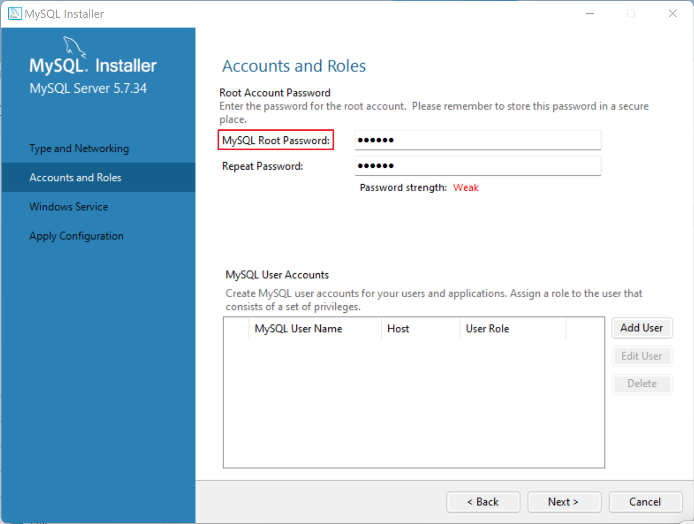
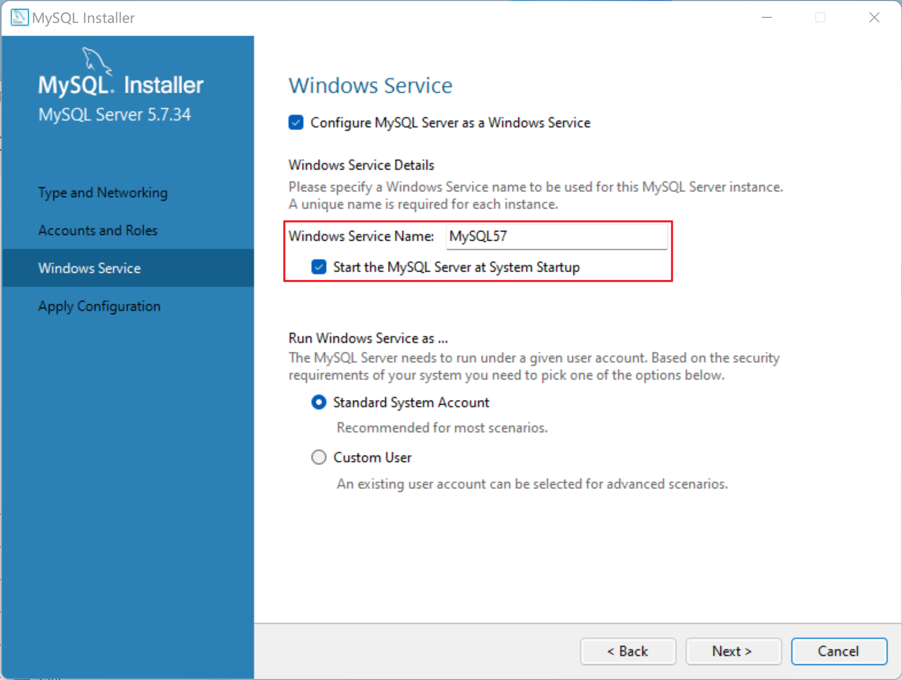
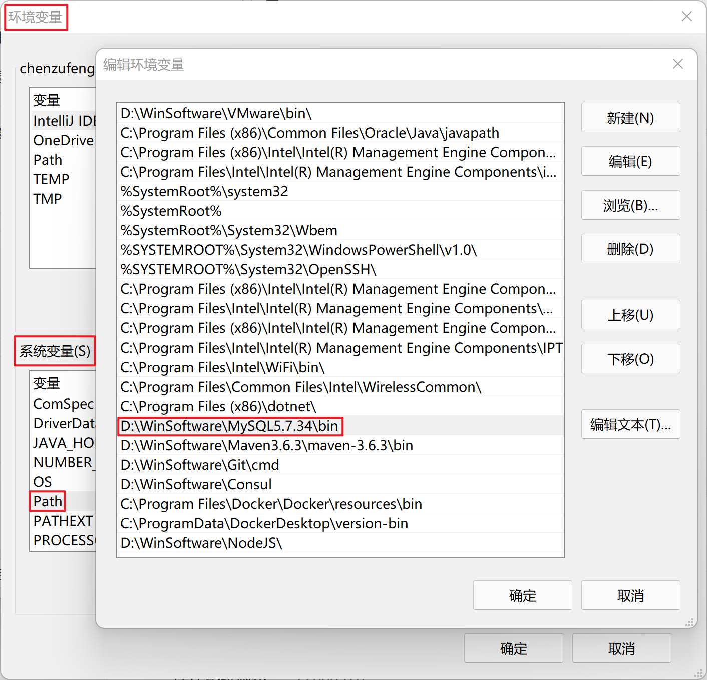
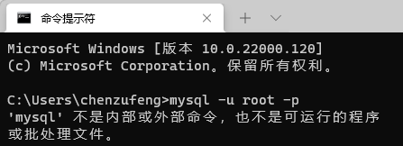
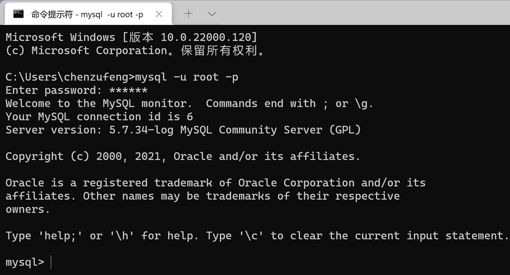
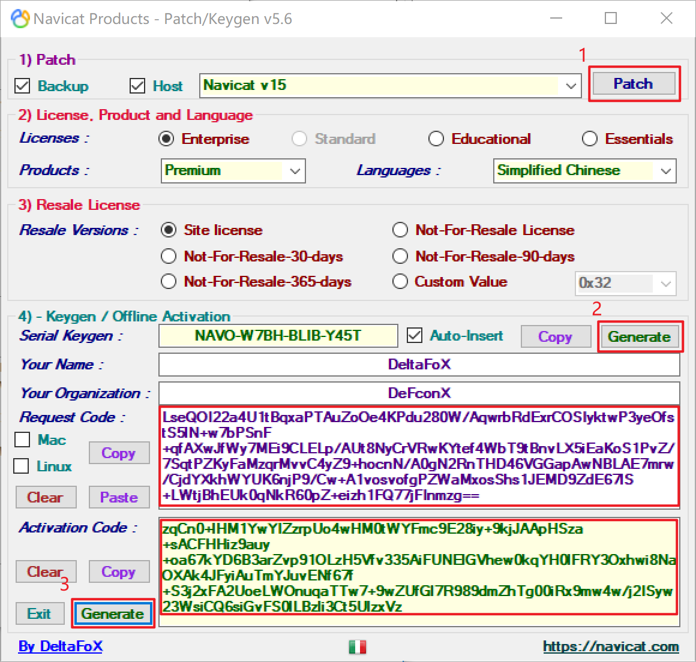
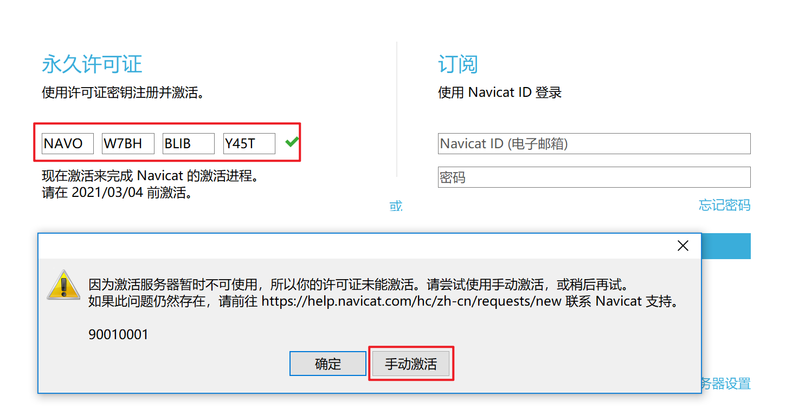
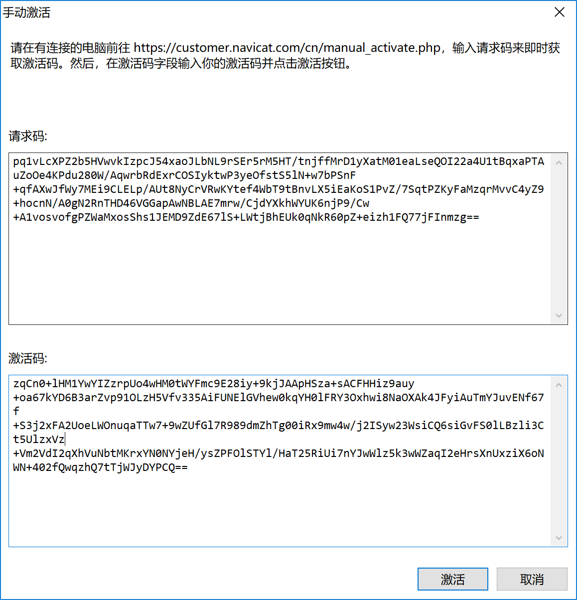

# MySQL 下载与安装

## 下载地址

MySQL（5.7.34 Windows (x86, 32-bit), MSI Installer）下载地址：[https://downloads.mysql.com/archives/installer/](https://downloads.mysql.com/archives/installer/)

## 安装过程

安装参考链接：[https://www.cnblogs.com/xuexianqi/p/12795890.html]()

下载后，点击安装文件，选择`Custom`自定义安装；选择`Advanced Options`自定义安装位置：


设置 root 密码：



开机默认启动：




## 设置环境变量

电脑 $$\rightarrow$$ 属性 $$\rightarrow$$ 高级系统设置 $$\rightarrow$$ 环境变量​



## 验证安装是否成功

未设置环境变量：



设置环境变量后：



查看安装的版本：

```mysql
C:\Users\chenzufeng>mysql --version
mysql  Ver 14.14 Distrib 5.7.34, for Win64 (x86_64)

C:\Users\chenzufeng>mysql -u root -p
Enter password: ******
Welcome to the MySQL monitor.  Commands end with ; or \g.
Your MySQL connection id is 3
Server version: 5.7.34-log MySQL Community Server (GPL)

mysql> select version();
+-------------+
| version()    |
+-------------+
| 5.7.34-log  |
+-------------+
1 row in set (0.01 sec)
```


# Navicat下载及安装



在==断网、关闭Navicat==状态下，打开破解软件：

- 运行注册机，勾选 Backup、Host 和 Navicat v15。**点击Patch按钮**，找到 Navicat Premium 15 安装路径下的navicat.exe，选中并点击打开，此时会提示：`navicat.exe - x64 -> Cracked`，提示已破解。

- 点击 2 处的 Generate，将自动生成 Serial Keygen（即注册码）。打开 Navicat Premium 15，点击注册（或菜单栏的帮助 $$\rightarrow$$​ 注册），输入上一步生成的注册码，然后点击激活，**紧接着点击手动激活**。

  

- 将 Navicat 手动激活窗口的请求码框中内容复制到注册机 Request Code 框中，点击 Activation Code 下面的 Generate 按钮。并将注册机 Activation Code 处生成的激活码内容复制到 Navicat 激活码框中激活即可。

  

