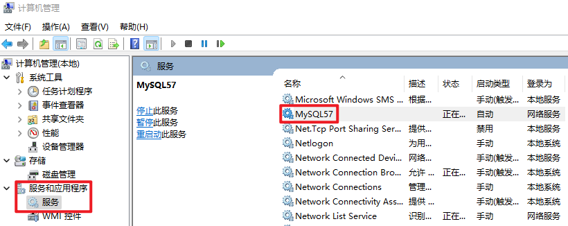
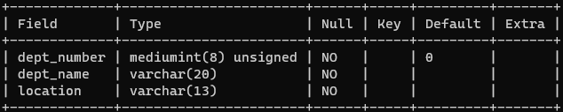

# 打开、登录服务

## 打开、关闭 MySQL

### 方法一



### 方法二

以管理员身份运行`Windows Terminal`：

```markdown
C:\Users\chenzufeng>net start MySQL57
MySQL57 服务正在启动 .
MySQL57 服务已经启动成功。

C:\Users\chenzufeng>net stop MySQL57
MySQL57 服务正在停止.
MySQL57 服务已成功停止。
```

## 登录

```markdown
C:\Users\chenzufeng>mysql -h localhost -P 3306 -u root -p
Enter password: ******
Welcome to the MySQL monitor.  Commands end with ; or \g.
......
Server version: 5.7.34-log MySQL Community Server (GPL)
......
mysql> exit # 或者 CTRL + c
Bye
```

# 常用命令

- ==不区分大小写==，但建议==关键字大写==，==表名、列名小写==；
- 每条命令用`;`或`\g`结尾。
- 注释：
  - 单行注释：`# 注释文字` 或者 `-- 注释文字`
  - 多行注释：`/* 注释文字 */`

```mysql
# 1. 查看所有数据库
mysql> show databases;

# 2. 打开指定的库
mysql> use 库名;

# 3. 显示当前所在的库名
mysql> select database();

# 4. 显示库中的所有表
mysql> show tables;

# 5. 显示指定库中的所有表（没有进入指定的库）
mysql> show tables from 库名;

# 6. 查看表的结构（describe）
mysql> desc dept;
mysql> describe dept;
mysql> DESCRIBE dept;
```



