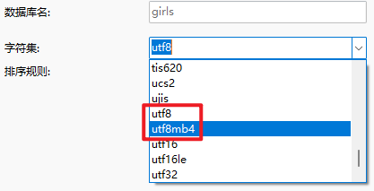

# utf8和utf8mb4

## utf8和utf8mb4区别

在mysql数据库中，编码格式中关于utf8的编码有两个，分别是**utf8**和**utf8mb4**：

utf8保存的==中文==是==3个字节==长度，这似乎是一个公理，**但这个公理是极大的误解。**中文里面，有20000多个汉字是占3个字节长度的，**但是，有50000多个汉字是占4个字节长度的！**

如果设置数据库字符集为utf8，则大部分的汉字是没有办法存在数据库中的，数据库会报“Incorrect string value”错误。

这是mysql数据库的一个bug。这个bug可能会导致数据的丢失，更糟糕的是，它可能导致**安全漏洞**。

mysql修改了这个bug，但是他们没有在任何地方公布这件事情，只是在字符集里面悄悄的增加了一个新的编码格式：`utf8mb4`，这个才是真正的UTF-8编码，他们没有直接修改bug，而是选择绕过了这个编码问题。

所以，要尽量使用utf8mb4的编码。

## 参考资料

[MYSQL数据库中编码格式的大陷阱：utf8的骗局](https://mp.weixin.qq.com/s/xQjboEuazLFk9o7oQrNeUA)

