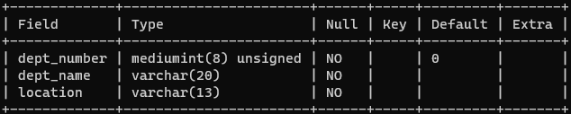

# 基础概念

SQL全称：Structured Query Language，是结构化查询语言，用于访问和处理数据库的标准的计算机语言。

SQL标准几经修改和完善，其功能更加强大，但目前很多数据库系统只支持SQL-99的部分特征，而大部分数据库系统都能支持1992年制定的==SQL-92==。

## 关系型和非关系型数据库

### 关系型数据库

关系型数据库：指用==关系模型==来组织数据信息的数据库。

关系模型指的是==二维表格模型==，而一个关系型数据库便是由==二维表==以及==表之间的关系==所构成的一个数据集合。

**关系型数据库的优势：**

1. 便于理解：二维表构造非常贴近逻辑；
2. 应用方便：支持通用的SQL（结构化查询语言）语句；
3. 易于维护：全部由表结构组成，文件格式一致；
4. 复杂操作：可以用SQL句子多个表之间实现非常繁杂的查询；
5. 事务管理：促使针对安全性性能很高的数据信息浏览规定得到完成。

**关系型数据库存在的不足**

1. ==读写性能差==，尤其是海量信息的效率高读写能力；
2. 固定不动的表构造，灵便度稍欠；
3. 高并发读写时，==硬盘I/O存在瓶颈==；
4. 可扩展性不足，不像web server和app server那样简单的添加硬件和服务节点来拓展性能和负荷工作能力。

### 非关系型数据库

非关系型数据库：指非关系型的，分布式系统的，且一般不确保遵照ACID标准的数据储存系统。

非关系型数据库算是一种数据结构化储存的集合，可以是==文档==或==键值对==等。

非关系型数据库的本质是传统关系型数据库的功能阉割版本，通过去掉不需要的功能来提高性能。

**非关系型数据库的类型：**

1. 键值储存数据库
2. 列储存数据库
3. 文档型数据库
4. 图数据库

**非关系型数据库的优点**

1. 格式灵活：数据存储格式非常多样，应用领域广泛，而关系型数据库则只适用基础的关系模型。
2. 性能优越：NOSQL是根据==键值对==的，不用历经SQL层的分析，因此==性能非常高==。
3. 可扩展性：基于键值对，数据之间耦合度极低，因此容易水平扩展。
4. 低成本：非关系型数据库部署简易，且大部分可以开源使用。

**非关系型数据库的不足：**

1. 不支持sql，学习和运用成本比较高；
2. 无事务处理机制；
3. 数据结构导致复杂查询不容易实现。


# 打开、登录服务

## 打开、关闭 MySQL

### 方法一


### 方法二

以管理员身份运行`Windows Terminal`：

```markdown
C:\Users\chenzufeng>net start MySQL57
MySQL57 服务正在启动 .
MySQL57 服务已经启动成功。

C:\Users\chenzufeng>net stop MySQL57
MySQL57 服务正在停止.
MySQL57 服务已成功停止。
```

## 登录

```markdown
C:\Users\chenzufeng>mysql -h localhost -P 3306 -u root -p
Enter password: ******
Welcome to the MySQL monitor.  Commands end with ; or \g.
......
Server version: 5.7.34-log MySQL Community Server (GPL)
......
mysql> exit # 或者 CTRL + c
Bye
```

# 常用命令

- ==不区分大小写==，但建议==关键字大写==，==表名、列名小写==；
- 每条命令用`;`或`\g`结尾。
- 注释：
  - 单行注释：`# 注释文字` 或者 `-- 注释文字`
  - 多行注释：`/* 注释文字 */`

```mysql
# 1. 查看所有数据库
mysql> show databases;

# 2. 打开指定的库
mysql> use 库名;

# 3. 显示当前所在的库名
mysql> select database();

# 4. 显示库中的所有表
mysql> show tables;

# 5. 显示指定库中的所有表（没有进入指定的库）
mysql> show tables from 库名;

# 6. 查看表的结构（describe）
mysql> desc dept;
mysql> describe dept;
mysql> DESCRIBE dept;
```



