# 导入数据库

## employees

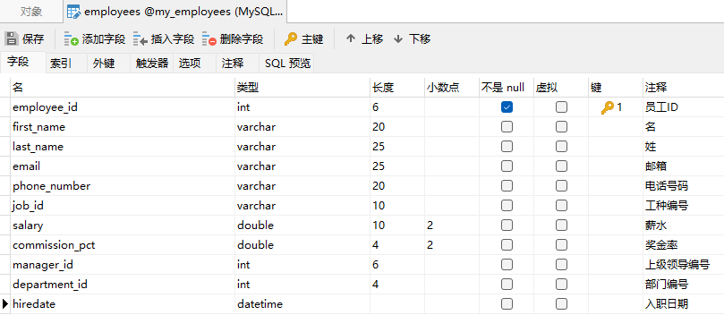

## departments

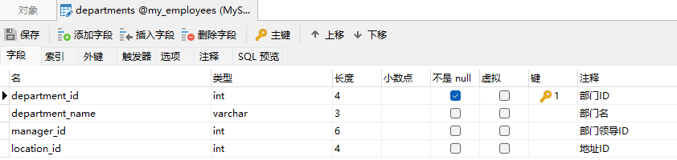

## locations

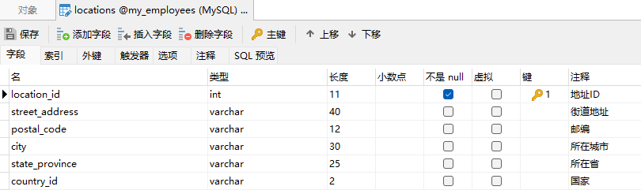

## jobs


# 基础查询

## 语法

```mysql
# 查询列表可以是：表中的字段、常量值、表达式、函数
# 查询的结果是一个虚拟的表格
SELECT 查询列表 FROM 表名;
```

## 简单查询

```mysql
# 进入指定数据库
USE my_employees;

# 查询常量值和表达式
SELECT 100;
SELECT 'john';
SELECT 100%98;

# 查询函数
SELECT VERSION();

# 查询表中的单个字段
# ``用于区分是否为关键字
SELECT `last_name` FROM employees;
SELECT last_name FROM employees;

# 查询表中的多个字段
SELECT last_name, salary, email FROM employees;

# 查询表中的所有字段
# 使用 * 查询得到的顺序为表中顺序
SELECT * FROM employees;

# 起别名
SELECT last_name AS 姓, first_name AS 名 FROM employees;

# 去重
# 查询员工表中涉及到的所有的部门编号
SELECT DISTINCT department_id FROM employees;

# mysql 中的 + 仅仅只有一个功能：运算符
    # 两个操作数都为数值型，则做加法运算
    SELECT 100 + 90;
    # 只要其中一方为字符型，试图将字符型数值转换成数值型
        # 如果转换成功，则继续做加法运算
        SELECT '123' + 90;
        SELECT "123" + 90;
        # 如果转换失败，则将字符型数值转换成 0
        SELECT 'a' + 1; # 1
        # 要其中一方为 null，则结果肯定为 null
        SELECT null + 10;

# 函数 CONCAT：CONCAT(str1, str2,...)
# 查询员工名和姓连接成一个字段，并显示为“姓名”
SELECT
	CONCAT( last_name, " ", first_name ) AS 姓名 
FROM
	employees;

# IFNULL(expression, alt_value)
# 用于判断第一个表达式是否为 NULL，如果为 NULL 则返回第二个参数的值，如果不为 NULL 则返回第一个参数的值。

SELECT
	IFNULL(commission_pct, 0) AS 奖金率, commission_pct
FROM
	employees;
```


# 条件查询

## 语法

```mysql
SELECT
    查询列表
From
    表名
WHERE
    筛选条件;
```

## 按条件表达式筛选

简单条件运算符：>、<、=、!=、<>、>=、<=

```mysql
# 查询 "工资 > 12000" 的员工信息
SELECT
	*
FROM
	employees
WHERE
	salary > 12000;

# 查询【部门编号不等于90号】的【员工名】和【部门编号】
SELECT
	CONCAT(last_name, " ", first_name), department_id
FROM
	employees
WHERE
	department_id != 90; # department_id <> 90
```

## 按逻辑表达式筛选

- && 和 and：两个条件都为true，结果为true，反之为false；
- || 或 or：只要有一个条件为true，结果为true，反之为false；
- ! 或 not：如果连接的条件本身为false，结果为true，反之为false。

```mysql
# 查询[工资在10000到20000之间]的[员工名]、[工资]以及[奖金]
SELECT
	CONCAT(last_name, " ", first_name),
	salary,
	commission_pct * salary
FROM
	employees
WHERE
	salary >= 10000 AND salary <= 20000;

# 查询[部门编号][不是在90到110之间]，[或者][工资高于15000]的员工信息
SELECT
	*
FROM
	employees
WHERE
	NOT(department_id >= 90 AND department_id <= 110) OR salary > 15000;
```

## 模糊查询

### like

```mysql
# 查询员工名中包含字符a的员工信息
SELECT
	*
FROM
	employees
WHERE
	last_name LIKE '%a%';

# 查询员工名中第三个字符为n，第五个字符为l的员工名和工资
SELECT
	CONCAT(last_name, " ", first_name),
	salary
FROM
	employees
WHERE
	last_name LIKE '__n_l%';

# 有问题！！！
# 查询员工名中第二个字符为_的员工名
SELECT
	last_name
FROM
	employees
WHERE
	last_name LIKE '_$_%' ESCAPE '$';
```

### between and

注意：包含临界值；左小右大

```mysql
# 查询员工编号在100到120之间的员工信息
SELECT                             
	*                               
FROM                               
	employees                       
WHERE                              
	employee_id BETWEEN 100 AND 120;
```

### in

判断某字段的值是否属于==in列表==中的某一项，列表的值类型必须一致或兼容。

```mysql
# 查询员工的工种编号是 IT_PROG、AD_VP、AD_PRES中的一个员工名和工种编号
SELECT
	last_name,
	job_id
FROM
	employees
WHERE
	job_id IN( 'IT_PROT' ,'AD_VP','AD_PRES'); # job_id = 'IT_PROT' OR job_id = 'AD_VP' OR JOB_ID ='AD_PRES';
```

### is null

```mysql
# 查询没有奖金的员工名和奖金率
SELECT
	last_name,
	commission_pct
FROM
	employees
WHERE
	commission_pct IS NULL;

# 查询有奖金的员工名和奖金率
SELECT
	last_name,
	commission_pct
FROM
	employees
WHERE
	commission_pct IS NOT NULL;
```

# 排序查询

## 语法

```mysql
SELECT
    查询列表
FROM 
    表名
WHERE 
    筛选条件
ORDER BY 
    排序的字段或表达式;
```

- asc 代表的是升序(*ascending order*)

- desc 代表的是降序(*descending order* )

- order by 子句可以支持 单个字段、别名、表达式、函数、多个字段

- order by 子句在查询语句的最后面，除了 limit 子句

## 实例

```mysql
# 按单个字段排序
# 按薪水降序排序
SELECT         
	*           
FROM           
	employees   
ORDER BY       
	salary DESC;

# 添加筛选条件再排序
# 查询[部门编号>=90]的员工信息，并按员工编号降序
SELECT 
    *
FROM 
    employees
WHERE 
    department_id >= 90
ORDER BY 
    employee_id DESC;

# 按表达式排序
# 查询员工信息，并按年薪降序
SELECT 
    *, salary * 12 * (1 + IFNULL(commission_pct, 0))
FROM 
    employees
ORDER BY 
    salary * 12 * (1 + IFNULL(commission_pct, 0)) DESC;

# 按别名排序
SELECT 
    *, salary * 12 * (1 + IFNULL(commission_pct, 0)) AS 年薪
FROM 
    employees
ORDER BY 
    年薪 DESC;

# 按函数排序
# 询员工名，并且按名字的长度降序
SELECT 
	LENGTH(last_name), last_name
FROM 
	employees
ORDER BY 
	LENGTH(last_name) DESC;

# 按多个字段排序
# 查询员工信息，要求按工资降序，按employee_id升序
SELECT 
	*
FROM 
	employees
ORDER BY 
	salary DESC, employee_id ASC;
```

# 常见函数

- 单行函数：如concat、length、ifnull等；

- 分组函数：做统计使用，又称为统计函数、聚合函数、组函数。

## 字符函数

```mysql
# 1.length 获取参数值的字节个数（utf-8一个汉字代表3个字节；gbk为2个字节）
SELECT LENGTH('john');
SELECT LENGTH('张三丰hahaha');
SHOW VARIABLES LIKE '%char%'

# 2.concat 拼接字符串
SELECT CONCAT(last_name, '_', first_name) AS 姓名 FROM employees;

# 3.upper、lower
SELECT UPPER('john');
SELECT LOWER('joHn');
# 示例：将姓变大写，名变小写，然后拼接
SELECT CONCAT(UPPER(last_name), " ", LOWER(first_name)) AS 姓名 FROM employees;

# 4.substr、substring 注意：索引从1开始
# 截取从指定索引处后面所有字符
SELECT SUBSTR('李莫愁爱上了陆展元', 4) AS out_put;

# 截取从指定索引处指定字符长度的字符
SELECT SUBSTR('李莫愁爱上了陆展元', 1, 3) AS out_put;

# 案例：姓名中首字符大写，其他字符小写然后用_拼接，显示出来
SELECT 
	CONCAT(UPPER(SUBSTR(last_name, 1, 1)), LOWER(SUBSTR(last_name, 2))) AS out_put,
	employee_id
FROM 
	employees
ORDER BY
	employee_id ASC;

# 5.instr 返回子串第一次出现的索引，如果找不到返回 0
SELECT INSTR('杨不殷六侠悔爱上了殷六侠', '侠') AS out_put;

# 6.trim
# TRIM ( [ [位置] [要移除的字串] FROM ] 字串): 
# [位置] 的可能值为 LEADING (起头), TRAILING (结尾), 或者 BOTH (起头及结尾)。 
# 这个函数将把 [要移除的字串] 从字串的起头、结尾，或是起头及结尾移除。
# 如果没有列出 [要移除的字串] 是什么，那空白就会被移除。
SELECT LENGTH(TRIM('    张翠山    ')) AS out_put;
SELECT TRIM('a' FROM 'aaaaaaaaa张aaaaaaaaaaaa翠山aaaaaaaaaaaaaaaaaaaaaaaaaaaaaaaaaaaaa') AS out_put;

# 7.lpad 用指定的字符实现左填充指定长度
# lpad(string, padded_length, [pad_string])：(准备被填充的字符串, 填充之后的字符串长度, 待填充字符串，是可选参数)
# 超过了指定长度会截断
SELECT LPAD('殷素素', 5, '*') AS out_put;

# 8.rpad 用指定的字符实现右填充指定长度
SELECT RPAD('殷素素', 12, 'ab') AS out_put;

# 9.replace 替换
SELECT REPLACE('周芷若爱上了张无忌', '周芷若', '赵敏') AS out_put;
```

## 数学函数

```mysql
# 1.round 四舍五入
SELECT ROUND(-1.55);
SELECT ROUND(1.567, 2);


# 2. ceil 向上取整，返回 >= 该参数的最小整数
SELECT CEIL(-1.02);

# 3. floor 向下取整，返回 <= 该参数的最大整数
SELECT FLOOR(-9.99);

# 4. truncate 截断
SELECT TRUNCATE(1.69999, 2);

# 5. mod 取余
SELECT MOD(10, -3);
SELECT 10 % 3;
```

## 日期函数

```mysql
# 1.now 返回当前系统日期 + 时间
# 2021-10-15 16:43:51
SELECT NOW();

# 2. curdate 返回当前系统日期，不包含时间
# 2021-10-15
SELECT CURDATE();

# 3. curtime 返回当前时间，不包含日期
# 16:43:51
SELECT CURTIME();


# 4.可以获取指定的部分，年、月、日、小时、分钟、秒
SELECT YEAR(NOW()) AS 年; # 2021
SELECT YEAR('1998-1-1') AS 年; # 1998
SELECT YEAR(hiredate) AS 年 FROM employees;


SELECT MONTH(NOW()) AS 月; # 10
# October
SELECT MONTHNAME(NOW()) AS 月; /*显示英文结论*/


# 5. str_to_date 将字符通过指定的格式转换成日期
# 1998-03-02
SELECT STR_TO_DATE('1998-3-2', '%Y-%c-%d') AS out_put;

# 6. 查询入职日期为1992-4-3的员工信息（数据库日期格式：1992-04-03 00:00:00）
SELECT * FROM employees WHERE hiredate = '1992-4-3';
SELECT * FROM employees WHERE hiredate = STR_TO_DATE('3-3 1998', '%c-%d %Y');


#date_format 将日期转换成字符

SELECT DATE_FORMAT(NOW(),'%y年%m月%d日') AS out_put;

#查询有奖金的员工名和入职日期(xx月/xx日 xx年)
SELECT last_name,DATE_FORMAT(hiredate,'%m月/%d日 %y年') 入职日期
FROM employees
WHERE commission_pct IS NOT NULL;

# 7. date_format 将日期转换成字符
SELECT DATE_FORMAT(NOW(),'%y年%m月%d日') AS out_put;

# 8. 查询有奖金的员工名和入职日期(xx月/xx日 xx年)
SELECT 
	last_name,
	DATE_FORMAT(hiredate, '%m月/%d日 %y年') AS 入职日期
FROM 
	employees
WHERE 
	commission_pct IS NOT NULL;
```

## 流程控制函数
```mysql
# 1. if 函数
SELECT IF(10 < 5, '大', '小'); # 小

SELECT 
	last_name,
	commission_pct,
	IF(commission_pct IS NULL, '没奖金，呵呵', '有奖金，嘻嘻') AS 备注
FROM employees;

# 2. case 函数
SELECT 
	salary AS 原始工资,
	department_id,
	CASE department_id
		WHEN 30 THEN salary * 1.1
		WHEN 40 THEN salary * 1.2
		WHEN 50 THEN salary * 1.3
		ELSE salary
		END AS 新工资
FROM employees;

SELECT 
	salary,
	CASE 
		WHEN salary > 20000 THEN 'A'
		WHEN salary > 15000 THEN 'B'
		WHEN salary > 10000 THEN 'C'
		ELSE 'D'
		END AS 工资级别
FROM employees;
```

## 分组函数

```mysql
# 1、简单的使用
SELECT SUM(salary) FROM employees;
SELECT AVG(salary) FROM employees;
SELECT MIN(salary) FROM employees;
SELECT MAX(salary) FROM employees;
SELECT COUNT(salary) FROM employees;

SELECT 
	SUM(salary) AS 和,
	AVG(salary) AS 平均,
	MAX(salary) AS 最高,
	MIN(salary) AS 最低,
	COUNT(salary) AS 个数
FROM employees;

# 2.查询员工表中的最大入职时间和最小入职时间的相差天数 （DIFFRENCE）

SELECT 
	MAX(hiredate) AS 最大,
	MIN(hiredate) AS 最小,
	DATEDIFF(MAX(hiredate), MIN(hiredate)) AS DIFFRENCE
FROM 
	employees;

# 3. 查询部门编号为90的员工个数
/* 所有列（字段），只要一行中有一个字段不为空，则行数累加 */
SELECT COUNT(*) FROM employees;
SELECT COUNT(*) FROM employees WHERE department_id = 90;
```

# 分组查询 Group by

| 分类       | ** 针对的表**       | **位置**    | **连接的关键字** |
| ---------- | ------------------- | ----------- | ---------------- |
| 分组前筛选 | 原始表              | group by 前 | where            |
| 分组后筛选 | group by 后的结果集 | group by 后 | having           |

一般来讲，能用分组前筛选的，尽量使用分组前筛选，提高效率。

## 分组前筛选

```mysql
# 案例1：查询每个工种的员工平均工资
SELECT 
	AVG(salary),
	job_id
FROM 
	employees
GROUP BY 
	job_id;

# 案例2：查询每个地方的部门个数
SELECT 
	COUNT(*),
	location_id
FROM 
	departments
GROUP BY 
	location_id;

# 案例3：查询邮箱中包含a字符的 每个部门的最高工资
SELECT 
	MAX(salary),
	department_id
FROM 
	employees
WHERE 
	email LIKE '%a%'
GROUP BY 
	department_id;

# 案例4：查询有奖金的每个领导手下员工的平均工资
SELECT 
	AVG(salary),
	manager_id
FROM 
	employees
WHERE 
	commission_pct IS NOT NULL
GROUP BY 
	manager_id;

# 案例5：查询【每个工种、每个部门】的最低工资，并按最低工资降序
SELECT 
	MIN(salary),
	job_id,
	department_id
FROM 
	employees
GROUP BY 
	department_id,
	job_id
ORDER BY 
	MIN(salary) DESC;
```

## 分组后筛选

```mysql
# 案例1：【每个工种】【有奖金】的员工的【最高工资>6000】的【工种编号】和【最高工资】，按最高工资升序

SELECT 
	job_id,
	MAX(salary) AS max_salary
FROM 
	employees
WHERE 
	commission_pct IS NOT NULL
GROUP BY 
	job_id
HAVING 
	max_salary > 6000
ORDER BY 
	max_salary ASC;

# 案例2：查询【各个管理者】手下员工的【最低工资】，其中最低工资不能低于6000，没有管理者的员工不计算在内
SELECT 
	MIN(salary),
	manager_id
FROM 
	employees
WHERE 
	manager_id IS NOT NULL
GROUP BY 
	manager_id
HAVING 
	MIN(salary) >= 6000;
```

# 连接查询

当查询的字段来自于多个表时，就会用到连接查询（多表查询）。

笛卡尔乘积现象：表1 有$m$行，表2有$n$行，结果为$m*n$行：

```mysql
SELECT
	name, boyName
FROM
	beauty, boys;
```

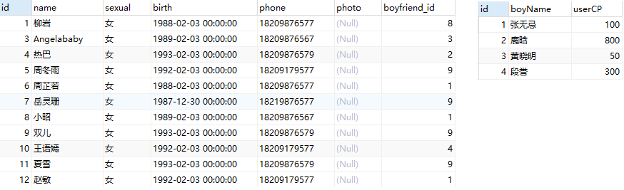

发生原因：没有有效的连接条件。

改进：

```mysql
SELECT
	`name`, boyName
FROM
	beauty, boys
WHERE
	beauty.boyfriend_id = boys.id;
```

## 语法与分类

### 语法（99）

```mysql
SELECT
	查询列表
FROM
	表1 别名 
【连接类型】JOIN 
	表2 别名
ON 
	连接条件
【WHERE 筛选条件】
【GROUP BY 分组】
【HAVING 筛选条件】
【ORDER BY 排序列表】
```

### 分类

内连接（inner）：

- 等值连接

- 非等值连接

- 自连接

 外连接（outer）：

- 左外连接：left (outer)

- 右外连接：right (outer)

- 全外连接：full (outer)

 交叉连接：cross

### 总结

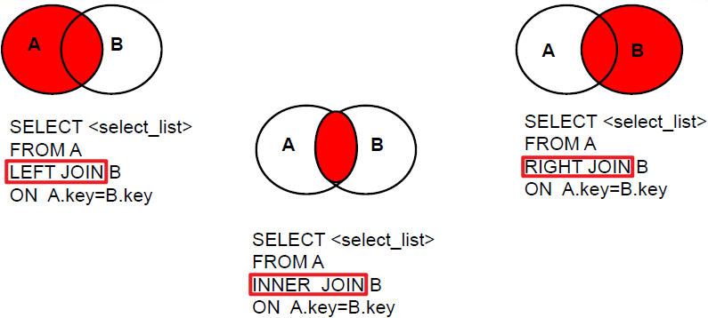

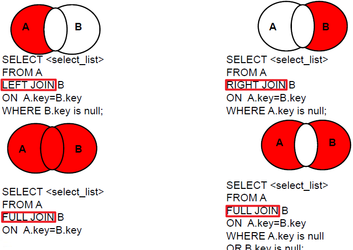

## 内连接

### 等值连接

- 多表等值连接的结果为多表的==交集==部分；
- 多表的顺序没有要求；

- 一般需要为表起别名。

#### sql92标准

```mysql
# 查询员工名与其对应的部门名
SELECT
	CONCAT( last_name, " ", first_name ),
	department_name 
FROM
	employees,
	departments 
WHERE
	employees.department_id = departments.department_id;

# 为表起别名
# 查询员工名、工种号、工种名

SELECT
	CONCAT( e.last_name, " ", e.first_name ) AS employee_name,
	e.job_id,
	j.job_title 
FROM
	employees e,
	jobs j 
WHERE
	e.job_id = j.job_id;

# 查询【有奖金】的每个部门的【部门名】和【部门的领导编号】和【该部门的最低工资】
SELECT
	departments.department_name,
	departments.manager_id,
	MIN(employees.salary) AS min_salary
FROM
	employees,
	departments
WHERE
	employees.commission_pct IS NOT NULL
	AND
	employees.department_id = departments.department_id
GROUP BY
	departments.department_id,
	departments.manager_id;

# 查询【每个工种】的【工种名】和【员工的个数】，并且按员工个数降序

SELECT
	job_title,
	COUNT(*) AS 员工数 # 通过连接，已经合为一张表
FROM
	jobs,
	employees
WHERE
	employees.`job_id` = jobs.`job_id`
GROUP BY
	job_title
ORDER BY
	员工数 DESC;

# 查询员工名、部门名和所在的城市
SELECT
	CONCAT( employees.last_name, " ", employees.first_name ),
	departments.department_name,
	locations.city
FROM
	employees,
	departments,
	locations
WHERE
	employees.department_id = departments.department_id
	AND
	departments.location_id = locations.location_id;
```

#### sql99标准

```mysql
# 查询员工名与其对应的部门名

SELECT
	last_name,
	department_name
FROM
	employees
INNER JOIN
	departments
ON
	employees.department_id = departments.department_id;

# 查询【部门个数 > 3（一个地方会有多个部门）】的【城市名】和【部门个数】
SELECT
	locations.city,
	COUNT(*) AS 部门个数
FROM
	departments
INNER JOIN
	locations
ON
	locations.location_id = departments.location_id;
GROUP BY
	locations.city
HAVING 部门个数 > 3;

# 查询【员工数 > 3】 的【部门名】和【员工个数】，并按照个数降序
# 1. 查询每个部门的员工个数
SELECT
	departments.department_name,
	COUNT(*) AS 员工个数
FROM
	employees
INNER JOIN
	departments
ON
	employees.department_id = departments.department_id
GROUP BY
	departments.department_name;
	
# 2. 在1的基础上筛选【员工数 > 3】
SELECT
	departments.department_name,
	COUNT(*) AS 员工个数
FROM
	employees
INNER JOIN
	departments
ON
	employees.department_id = departments.department_id
GROUP BY
	departments.department_name
HAVING 员工个数 > 3
ORDER BY 员工个数 ASC;

# 查询员工名、部门名、工种号、工种名，并按照部门名降序
SELECT
	employees.last_name,
	departments.department_name,
	jobs.job_title
FROM
	employees
INNER JOIN departments ON employees.department_id = departments.department_id
INNER JOIN jobs ON employees.job_id = jobs.job_id
ORDER BY
	departments.department_name DESC;
```


### 非等值连接

#### sql92标准

```mysql
# 查询员工的【工资】和【工资级别】
SELECT
	CONCAT( last_name, " ", first_name ) AS 员工名,
	employees.salary,
	job_grades.grade_level 
FROM
	employees,
	job_grades 
WHERE
	employees.salary BETWEEN job_grades.lowest_sal 
	AND job_grades.highest_sal 
ORDER BY
	job_grades.grade_level;
```

#### sql99标准

```mysql
# 查询员工的【工资】和【工资级别】
SELECT
	employees.salary,
	job_grades.grade_level
FROM
	employees
INNER JOIN
	job_grades
ON
 employees.salary BETWEEN job_grades.lowest_sal AND job_grades.highest_sal
ORDER BY
	job_grades.grade_level;
	
# 查询工资级别个数 > 20 的数量，并且按工资级别降序
SELECT
	COUNT(*) 个数,
	job_grades.grade_level
FROM
	employees
INNER JOIN
	job_grades
ON
	employees.salary BETWEEN job_grades.lowest_sal AND job_grades.highest_sal
GROUP BY
	job_grades.grade_level
HAVING 个数 > 20
ORDER BY job_grades.grade_level DESC;
```


### 自连接

#### sql92标准

```mysql
SELECT
	e.employee_id AS 员工ID,
	CONCAT( e.last_name, " ", e.first_name ) AS 员工名,
	e.manager_id AS 上级领导ID
FROM
	employees e;
	
SELECT
	m.employee_id AS 上级领导ID,
	CONCAT( m.last_name, " ", m.first_name ) AS 上级领导名
FROM
	employees m;
```

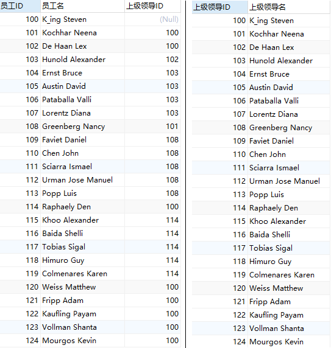

```mysql
# 案例：查询【员工名】和【上级的名称】
# manager_id是与表中employee_id对应的
SELECT
	e.employee_id AS 员工ID,
	CONCAT( e.last_name, " ", e.first_name ) AS 员工名,
	m.employee_id AS 上级领导ID,
	CONCAT( m.last_name, " ", m.first_name ) AS 上级名
FROM
	employees e,
	employees m 
WHERE
	e.manager_id = m.employee_id;
```

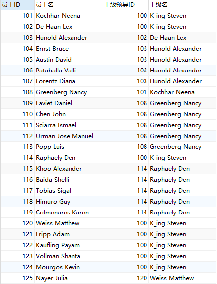

#### sql99标准

```mysql
# 案例：查询【员工名】和【上级的名称】
# manager_id是与表中employee_id对应的
SELECT
	e.employee_id AS 员工ID,
	CONCAT( e.last_name, " ", e.first_name ) AS 员工名,
	m.employee_id AS 上级领导ID,
	CONCAT( m.last_name, " ", m.first_name ) AS 上级名
FROM
	employees e
INNER JOIN
	employees m
ON
	e.manager_id = m.employee_id;
```

## 外连接

应用场景：查询在一个表中有，另一个表中没有的记录。

特点：外连接的查询结果为主表中的所有记录

- 如果从表中有匹配的，则显示匹配的值
- 如果从表中没有匹配的，则显示NULL
- 外连接查询结果 = 内连接结果 + 主表中有而从表中没有的记录

区分主从表：

- 左外连接：`left join` 左边的是主表
- 右外连接：`right join` 右边的是主表

### 左、右外连接

```mysql
# 案例：查询男友在boys表中的女生名（女生名及其男友信息）

# 步骤一：查询女生的男友信息
SELECT
	beauty.name,
	boys.*
FROM
	beauty
LEFT JOIN
	boys
ON
beauty.boyfriend_id = boys.id;
```

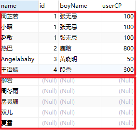

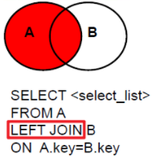

右步骤一结果可知，左连接为`beauty.name`+`boys.*`（并且需满足`beauty.boyfriend_id = boys.id`；不满足的则为空）

```mysql
# 步骤二：添加筛选条件
SELECT
	beauty.name,
	boys.*
FROM
	beauty
LEFT JOIN
	boys
ON
beauty.boyfriend_id = boys.id
WHERE
	boys.id IS NOT NULL; # boys.id 从表主键

# 右外连接
# 案例：查询男友在boys表中的女生名（女生名及其男友信息）
SELECT
	beauty.name,
	boys.*
FROM
	boys
RIGHT JOIN
	beauty
ON
beauty.boyfriend_id = boys.id
WHERE
	boys.id IS NOT NULL;
```


```mysql
# 案例：查询哪个部门（department_id）没有员工（employee_id）
# 步骤一：查询部门的员工，部门为主表
SELECT
	departments.*,
	employees.employee_id
FROM
	departments # 主表
LEFT JOIN
	employees
ON
	departments.department_id = employees.department_id;
```


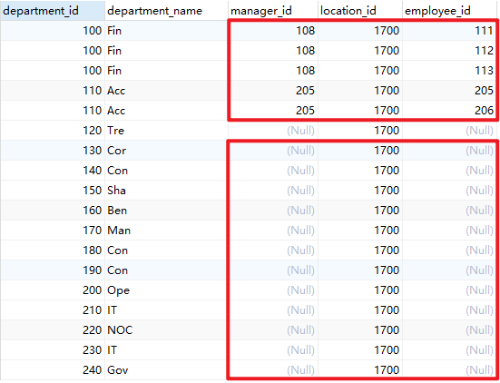

```mysql
# 步骤二：添加筛选条件
SELECT
	departments.*,
	employees.employee_id
FROM
	departments # 主表
LEFT JOIN
	employees
ON
	departments.department_id = employees.department_id
WHERE
	employees.employee_id IS NULL;

# 右外
SELECT
	departments.*,
	employees.employee_id
FROM
	employees
RIGHT JOIN
	departments # 主表
ON
	departments.department_id = employees.department_id
WHERE
	employees.employee_id IS NULL;
```

### 全外连接

全外连接 = 内连接结果 + 表1中有，表2中没有 + 表2中有，表1中没有（==MySQL不支持==）

```mysql
SELECT
	beauty.*,
	boys.*
FROM
	beauty
FULL JOIN
	boys
ON
	beauty.boyfriend_id = boys.id;
```

### 交叉连接

笛卡尔乘积

```mysql
SELECT
	beauty.*,
	boys.*
FROM
	beauty
CROSS JOIN
	boys
```


# 子查询

## 概念与分类

**含义：**

- SELECT出现在其他语句中的 SELECT 语句，称为==子查询==或==内查询==

- 外部的查询语句，称为==主查询==或==外查询==

**分类：**

- 按子查询出现的位置：

  - SELECT 后面：仅仅支持标量子查询
  - FROM 后面：支持表子查询

  - WHERE 或 HAVING 后面 ★：

    - 标量子查询（单行） √

    - 列子查询 （多行） √

    - 行子查询

  - EXISTS 后面（相关子查询）
    - 表子查询

- 按结果集的行列数不同：

  - 标量子查询（结果集只有一行一列）

  - 列子查询（结果集只有一列多行）

  - 行子查询（结果集有一行多列）

  - 表子查询（结果集一般为多行多列）

# 分页查询 Limit

## 语法

```mysql
SELECT
	查询列表
FROM
	表1
JoinType Join 
	表2
ON
	连接条件
WHERE
	筛选条件
GROUP BY
	分组字段
HAVING
	分组后的筛选
ORDER BY
	排序的字段
LIMIT
	# offset=(page - 1)*size：要显示条目的起始索引（起始索引从0开始）
	# size：要显示的条目个数
	【offset,】size;
```

## 实例

```mysql
# 案例1：查询前五条员工信息
SELECT
	* 
FROM
	employees 
LIMIT 0, 5;

SELECT
	* 
FROM
	employees 
LIMIT 5;

# 案例2：查询第11条至第25条
SELECT
	* 
FROM
	employees 
LIMIT 10, 15;

# 案例3：有奖金的员工信息，并且工资较高的前10名显示出来
SELECT
	* 
FROM
	employees
WHERE
	commission_pct IS NOT NULL
ORDER BY
	salary DESC
LIMIT 10;
```


# 联合查询

**union 联合**/合并：将多条查询语句的结果合并成一个结果。

```mysql
# 查询【部门编号 >90】 或【邮箱包含a】的员工信息
SELECT
	*
FROM
	employees
WHERE
	department_id > 90 OR email LIKE '%a%';

# 使用UNION
SELECT * FROM employees WHERE department_id > 90
UNION
SELECT * FROM employees WHERE email LIKE '%a%';
```

**应用场景**：

要查询的==结果来自于多个表==，且==多个表没有直接的连接关系==，但查询的信息一致时。

**特点**：

1、要求多条查询语句的==查询列数是一致的==！

2、要求多条查询语句的查询的每一列的类型和顺序最好一致 （避免在含义上弄混）

3、`UNION`关键字默认==去重==，如果使用`UNION ALL`可以包含重复项。

