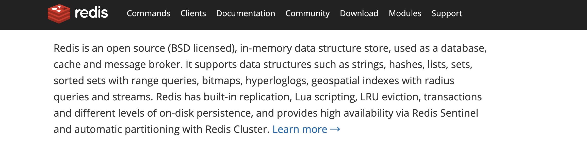
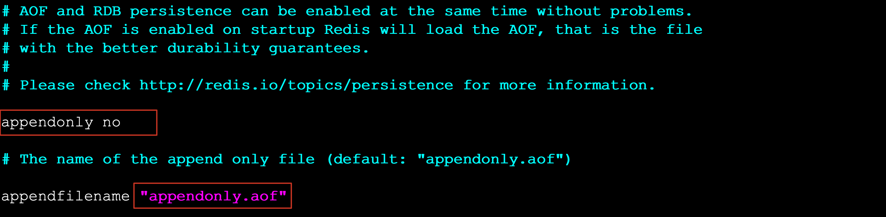

# NoSQL与Redis引言

**NoSQL**(` Not Only SQL` )，意即**不仅仅是SQL**，泛指`非关系型`的数据库。Nosql这个技术门类，早期就有人提出，发展至2009年趋势越发高涨。

## 为什么是NoSQL

随着互联网网站的兴起，传统的关系数据库在应付动态网站，特别是`超大规模`和`高并发`的纯动态网站已经显得力不从心，暴露了很多难以克服的问题。

如`商城网站中对商品数据频繁查询`、`对热搜商品的排行统计`、`订单超时问题`、以及`微信朋友圈（音频，视频）存储`等相关，使用传统的关系型数据库实现就显得非常复杂，虽然能实现相应功能但是在性能上却不是那么乐观。NoSQL这个技术门类的出现，更好的解决了这些问题，它告诉了世界不仅仅是SQL。

## NoSQL的四大分类

### 键值(Key-Value)存储数据库

```markdown
# 1.说明: 
- 这一类数据库主要会使用到一个哈希表，这个表中有一个特定的键和一个指针指向特定的数据。

# 2.特点
- Key/Value模型对于IT系统来说的优势在于简单、易部署。  
- 但是如果DBA只对【部分值】进行查询或更新的时候，Key/Value就显得效率低下了。

# 3.相关产品
- Tokyo Cabinet/Tyrant,
- Redis（内存）
- SSDB（硬盘）
- Voldemort 
- Oracle BDB
```

### 列存储数据库

```markdown
# 1.说明
- 这部分数据库通常是用来应对分布式存储的海量数据。

# 2.特点
- 键仍然存在，但是它们的特点是指向了多个列。这些列是由列家族来安排的。

# 3.相关产品
- Cassandra、【HBase】、Riak.
```

### 文档型数据库

```markdown
# 1.说明
- 文档型数据库的灵感是来自于Lotus Notes办公软件的，而且它同第一种键值存储相类似该类型的数据模型是版本化的文档，半结构化的文档以特定的格式存储，比如JSON。文档型数据库可以看作是键值数据库的升级版，允许之间嵌套键值。而且文档型数据库比键值数据库的查询效率更高

# 2.特点
- 以文档形式存储
	{"id": "21", "name": "chen", "tags": ["男", "学生"]}
- 支持复杂数据存储、简化库表设计

# 3.相关产品
- `MongoDB`、CouchDB、 MongoDb(4.x)。国内也有文档型数据库SequoiaDB，已经开源。
```

### 图形(Graph)数据库

 ```markdown
# 1.说明
- 图形结构的数据库同其他行列以及刚性结构的SQL数据库不同，它是使用灵活的图形模型，并且能够扩展到多个服务器上。

# 2.特点
- NoSQL数据库没有标准的查询语言(SQL)，因此进行数据库查询需要制定数据模型。许多NoSQL数据库都有REST式的数据接口或者查询API。

# 3.相关产品
- Neo4J、InfoGrid、 Infinite Graph、
 ```

----

## NoSQL应用场景

- 数据模型比较简单

- 需要灵活性更强的IT系统

- 对数据库性能要求较高

- 不需要高度的数据一致性

## 什么是Redis



> Redis is an open source (BSD licensed), in-memory data structure store, used as a database, cache and message broker.

Redis开源、遵循BSD、基于内存（读写快、断电立即消失）数据存储，被用于作为数据库缓存消息中间件

- 总结: redis是一个`内存型`的数据库，具有`持久化机制`：将内存数据定期写入到磁盘中

## Redis特点与应用场景

-  Redis是一个高性能key/value内存型数据库

- Redis支持丰富的数据类型 

- Redis支持持久化 

- Redis单线程、单进程（线程安全），用于实现分布式锁

应用场景：

- Redis`自动超时`功能（字符串类型）可实现`短信验证码`——时效性业务功能（订单支付时间）
- 完成分布式集群系统中Session共享，解决数据上限、数据类型单一问题
- 可排序set类型——ZSet（元素、分数）：销量排行榜
- 分布式缓存——现在内存中查找，没有再去数据库查，然后放入redis缓存中，效率更高
- 存储认证后token信息——微信小程序、微信公众号
- 解决分布式集群系统中分布式锁问题——redis单进程、单线程

## Redis安装

```markdown
# 0.准备环境
- CentOS8

# 1.下载redis源码包
- https://redis.io/
```


```markdown
# 2.下载完整源码包
redis-6.2.4.tar.gz
```


```markdown
# 3.将下载redis资料包上传到Linux中
```

```shell
[root@Chenzf WinSoftware]# cd Redis
[root@Chenzf Redis]# ls
redis-6.2.4.tar.gz
```


```markdown
# 4.解压缩文件
[root@localhost ~]# tar -zxvf redis-6.2.4.tar.gz
[root@localhost ~]# ll
```

```shell
[root@Chenzf Redis]# ll
total 2404
drwxrwxrwx 1 root root    4096 Jun  1 22:03 redis-6.2.4
-rwxrwxrwx 1 root root 2457940 Jun 22 15:24 redis-6.2.4.tar.gz
```


```markdown
# 5.安装gcc
[root@Chenzf Redis]# cd redis-6.2.4
[root@Chenzf redis-6.2.4]# make
-bash: make: command not found
[root@Chenzf redis-6.2.4]# yum -y install gcc automake autoconf libtool make

# 6.进入解压缩目录执行如下命令
[root@Chenzf redis-6.2.4]# make
- make MALLOC=libc

# 7.编译完成后执行如下命令（可选）
- make install PREFIX=/usr/redis

# 8.进入安装目录
# 8.1.启动redis服务 
- ./redis-server
redis服务器默认没有开启远程连接，即默认拒绝所有远程客户端连接
```


```markdown
# 8.2.打开新的terminal，进入安装目录，执行客户端命令/redis-cli
[root@Chenzf mnt]# cd ./d/WinSoftware/Redis/redis-6.2.4
[root@Chenzf redis-6.2.4]# src/redis-cli
127.0.0.1:6379> set name chenzufeng
OK
127.0.0.1:6379> get name
"chenzufeng"
127.0.0.1:6379> keys *
1) "name"
```


# Redis数据库相关指令

## 数据库操作指令

```markdown
# 1.Redis中库说明
- Redis的配置文件位于Redis安装目录下，文件名为redis.conf
- 使用redis的默认配置启动redis服务后，默认会存在16个库（彼此隔离，互不影响），编号从0-15
- 可以使用select库的编号来选择一个redis的库
```

```shell
127.0.0.1:6379> select 1
OK
127.0.0.1:6379[1]> select 0
OK
127.0.0.1:6379>
```

```markdown
# 2.Redis中操作库的指令
- 清空【当前】的库  FLUSHDB
- 清空全部的库  FLUSHALL

# 3.redis客户端显示中文
-	./redis-cli  -p 7000（在配置文件中修改了端口号后启动redis） --raw（设置客户端显示中文）

# 4.修改redis服务器的端口
- port 7000
修改后需要加载配置进行启动：
- # src/redis-server redis.conf
```


## 操作key相关指令

```markdown
# 1.DEL指令
- 语法 :  DEL key [key ...] 
- 作用 :  删除给定的一个或多个key 。不存在的key 会被忽略。
- 可用版本： >= 1.0.0
- 返回值： 被删除key 的数量。 

# 2.EXISTS指令
- 语法:  EXISTS key
- 作用:  检查给定key 是否存在。
- 可用版本： >= 1.0.0
- 返回值： 若key 存在，返回1 ，否则返回0。

# 3.EXPIRE
- 语法:  EXPIRE key seconds
- 作用:  为给定key 设置生存时间，当key 过期时(生存时间为0 )，它会被自动删除。
- 可用版本： >= 1.0.0
- 时间复杂度： O(1)
- 返回值：设置成功返回1 。

# 4.KEYS
- 语法 :  KEYS pattern
- 作用 :  查找所有符合给定模式pattern 的key 。
- 语法:
	KEYS * 匹配数据库中所有key 。
	KEYS h?llo 匹配hello ，hallo 和hxllo 等。
	KEYS h*llo 匹配hllo 和heeeeello 等。
	KEYS h[ae]llo 匹配hello 和hallo ，但不匹配hillo 。特殊符号用 "\" 隔开
- 可用版本： >= 1.0.0
- 返回值： 符合给定模式的key 列表。

# 5.MOVE
- 语法 :  MOVE key db
- 作用 :  将当前数据库的key 移动到指定的数据库db当中。
- 可用版本： >= 1.0.0
- 返回值： 移动成功返回1 ，失败则返回0 。

# 6.PEXPIRE
- 语法 :  PEXPIRE key milliseconds
- 作用 :  这个命令和EXPIRE 命令的作用类似，但是它以毫秒为单位设置key 的生存时间，而不像EXPIRE 命令那样，以秒为单位。
- 可用版本： >= 2.6.0
- 时间复杂度： O(1)
- 返回值：设置成功，返回1  key 不存在或设置失败，返回0

# 7.PEXPIREAT
- 语法 :  PEXPIREAT key milliseconds-timestamp
- 作用 :  这个命令和EXPIREAT 命令类似，但它以毫秒为单位设置key 的过期unix 时间戳，而不是像EXPIREAT那样，以秒为单位。
- 可用版本： >= 2.6.0
- 返回值：如果生存时间设置成功，返回1 。当key 不存在或没办法设置生存时间时，返回0 。(查看EXPIRE 命令获取更多信息)

# 8.TTL
- 语法 :   TTL key
- 作用 :   以秒为单位，返回给定key的剩余生存时间(TTL, time to live)。
- 可用版本： >= 1.0.0
- 返回值：
	当key 不存在时，返回-2 。
	当key 存在但没有设置剩余生存时间时，返回-1 。
	否则，以秒为单位，返回key 的剩余生存时间。
- Note : 在Redis 2.8 以前，当key 不存在，或者key 没有设置剩余生存时间时，命令都返回-1 。

# 9.PTTL
- 语法 :  PTTL key
- 作用 :  这个命令类似于TTL 命令，但它以毫秒为单位返回key 的剩余生存时间，而不是像TTL 命令那样，以秒为单位。
- 可用版本： >= 2.6.0
- 返回值： 当key 不存在时，返回-2 。当key 存在但没有设置剩余生存时间时，返回-1 。
- 否则，以毫秒为单位，返回key 的剩余生存时间。
- 注意 : 在Redis 2.8 以前，当key 不存在，或者key 没有设置剩余生存时间时，命令都返回-1 。

# 10.RANDOMKEY
- 语法 :  RANDOMKEY
- 作用 :  从当前数据库中随机返回(不删除) 一个key 。
- 可用版本： >= 1.0.0
- 返回值：当数据库不为空时，返回一个key 。当数据库为空时，返回nil 。

# 11.RENAME
- 语法 :  RENAME key newkey
- 作用 :  将key 改名为newkey 。当key 和newkey 相同，或者key 不存在时，返回一个错误。当newkey 已经存在时，RENAME 命令将覆盖旧值。
- 可用版本： >= 1.0.0
- 返回值： 改名成功时提示OK ，失败时候返回一个错误。

# 12.TYPE
- 语法 :  TYPE key
- 作用 :  返回key 所储存的值的类型。
- 可用版本： >= 1.0.0
- 返回值：
	none (key 不存在)
	string (字符串)
	list (列表)
	set (集合)
	zset (有序集)
	hash (哈希表)
```

## String类型

### 内存存储模型


### 常用操作命令

| 命令                                           | 说明                                        |
| ---------------------------------------------- | ------------------------------------------- |
| set                                            | 设置一个key/value                           |
| get                                            | 根据key获得对应的value                      |
| mset：more set                                 | 一次设置多个key value                       |
| mget                                           | 一次获得多个key的value                      |
| getset                                         | 获得原始key的值，同时设置新值               |
| strlen                                         | 获得对应key存储value的长度                  |
| append                                         | 为对应key的value追加内容                    |
| getrange：索引0开始                            | 截取value的内容                             |
| setex                                          | 设置一个key存活的有效期（秒）（验证码）     |
| psetex                                         | 设置一个key存活的有效期（毫秒）             |
| setnx                                          | 存在不做任何操作，不存在添加                |
| msetnx：原子操作（只要有一个存在不做任何操作） | 可以同时设置多个key，只要有一个存在都不保存 |
| decr                                           | 进行数值类型的-1操作                        |
| decrby                                         | 根据提供的数据进行减法操作                  |
| Incr                                           | 进行数值类型的+1操作                        |
| incrby                                         | 根据提供的数据进行加法操作                  |
| Incrbyfloat                                    | 根据提供的数据加入浮点数                    |

## List类型

list列表相当于Java中list集合，特点：可以从左边、右边进行添加；元素有序且可以重复。

### 内存存储模型


### 常用操作指令

| 命令    | 说明                                                         |
| ------- | ------------------------------------------------------------ |
| lpush   | `创建一个列表`同时，将某个值加入到一个key列表`头部`<br>`lpush key element [element ...]` |
| lpushx  | 同lpush，但是必须要保证这个key存在，`不会创建列表`<br>`lpushx key element [element ...]` |
| rpush   | 将某个值加入到一个key列表`末尾`                              |
| rpushx  | 同rpush，但是必须要保证这个key存在                           |
| lpop    | 返回和移除列表左边的第一个元素<br>`lpop key [count]`：count值移除几个元素 |
| rpop    | 返回和移除列表右边的第一个元素                               |
| lrange  | 获取某一个下标区间内的元素<br>`lrange key start stop`        |
| llen    | 获取列表元素个数                                             |
| lset    | 设置某一个指定索引的值（索引必须存在）<br>`lset key index element` |
| lindex  | 获取某一个指定索引位置的元素<br>`lindex key index`           |
| lrem    | 删除重复元素<br>`lrem key count element`：count删除重复元素中几个 |
| ltrim   | 保留列表中特定区间内的元素                                   |
| linsert | 在某一个元素(pivot)之前，之后插入新元素<br>`linsert key BEFORE|AFTER pivot element` |

##  Set类型

Set类型（Set集合）：元素无序、不可以重复

### 内存存储模型


### 常用命令

| 命令        | 说明                                                         |
| ----------- | ------------------------------------------------------------ |
| sadd        | 为集合添加元素<br>`sadd key member [membere ...]`            |
| smembers    | 显示集合中所有元素（无序）                                   |
| scard       | 返回集合中元素的个数                                         |
| spop        | 随机返回一个(count)元素，并将元素在集合中删除<br>`spop key [count]`：count指删除个数 |
| smove       | 从一个集合中向另一个集合移动元素，必须是同一种类型           |
| srem        | 从集合中删除一个元素                                         |
| sismember   | 判断一个集合中是否含有这个元素                               |
| srandmember | 随机返回元素                                                 |
| sdiff       | 去掉第一个集合中其它集合含有的相同元素                       |
| sinter      | 求交集                                                       |
| sunion      | 求和集                                                       |

## ZSet类型

特点：可排序的set集合，排序、不可重复 

### 内存模型


### 常用命令

| 命令                             | 说明                                                         |
| -------------------------------- | ------------------------------------------------------------ |
| zadd                             | 添加一个有序集合元素<br>`zadd key [NX|XX] [GT|LT] [CH] [INCR] score member [score member ...]`<br>`zadd zsets 1 chen 2 zufeng 3 chen`：3 chen替代了1 chen |
| zcard                            | 返回集合的元素个数                                           |
| zrange：升序<br> zrevrange：降序 | 返回一个范围内的元素<br>`zrange key min max [BYSCORE|BYLEX] [REV] [LIMIT offset count] [WITHSCORES]`：`zrange zsets 0 -1` |
| zrangebyscore                    | 按照分数查找一个范围内的元素                                 |
| zrank                            | 返回member的排名：`zrank key member`                         |
| zrevrank                         | 倒序排名                                                     |
| zscore                           | 显示某一个元素的分数                                         |
| zrem                             | 移除某一个元素                                               |
| zincrby                          | 给某个特定元素member加increment分<br>`zincrby key increment member` |

## hash类型

key(String) value(map)，类似于Map<String, Map<String, value>>

### 内存模型


### 常用命令

| 命令         | 说明                                                         |
| ------------ | ------------------------------------------------------------ |
| hset         | 设置一个key/value对<br>`hset key field value [field value ...]` |
| hget         | 获得一个key对应的value                                       |
| hgetall      | 获得所有的key/value对                                        |
| hdel         | 删除某一个key/value对                                        |
| hexists      | 判断一个key是否存在                                          |
| hkeys        | 获得所有的key                                                |
| hvals        | 获得所有的value                                              |
| hmset        | 设置多个key/value                                            |
| hmget        | 获得多个key的value                                           |
| hsetnx       | 设置一个不存在的key的值：不存在key（Hash类型的value中的key）才设置 |
| hincrby      | 为value进行加法运算                                          |
| hincrbyfloat | 为value加入浮点值                                            |


# 持久化机制

Redis官方提供了两种不同的【持久化】方法来将【内存数据】存储到【硬盘】里面分别是:

- 快照(Snapshot)
- AOF (Append Only File) 只追加日志文件

## 快照(Snapshot)

### 特点

这种方式可以将`某一时刻的所有数据`都写入硬盘中，这是**redis的默认开启持久化方式**，保存的文件是以`.rdb`形式结尾的文件，因此这种方式也称之为RDB方式。

```shell
[root@Chenzf redis-6.2.4]# ls
... dump.rdb  src ...
```


### 快照生成方式

- 客户端方式：BGSAVE 和 SAVE指令
- 服务器配置自动触发

```markdown
# 1.客户端方式之BGSAVE
- 客户端可以使用BGSAVE命令来创建一个快照，当接收到客户端的BGSAVE命令时，redis会调用fork来创建一个【子进程】，然后【子进程负责将快照写入磁盘中】，而【父进程则继续处理命令请求】。
	
名词解释：fork当一个进程创建子进程的时候，底层的操作系统会创建该进程的一个副本，在类unix系统中创建子进程的操作会进行优化：在刚开始的时候，父子进程共享相同内存，直到父进程或子进程对内存进行了写之后，对被写入的内存的共享才会结束服务。
```


```markdown
# 2.客户端方式之SAVE
- 客户端还可以使用SAVE命令来创建一个快照，接收到SAVE命令的redis服务器在快照创建完毕之前，将不再响应任何其他的命令
```


- **注意：SAVE命令并不常用，使用SAVE命令在快照创建完毕之前，redis处于阻塞状态，无法对外服务**

```markdown
# 3.服务器配置方式之满足配置自动触发
- 如果用户在redis.conf中设置了save配置选项，redis会在save选项条件满足之后自动触发一次BGSAVE命令，如果设置多个save配置选项，当任意一个save配置选项条件满足，redis也会触发一次BGSAVE命令
```


```markdown
# 4.服务器接收客户端shutdown指令
- 当redis通过shutdown指令接收到关闭服务器的请求时，会执行一个save命令，阻塞所有的客户端，不再执行客户端执行发送的任何命令，并且在save命令执行完毕之后关闭服务器
```

### 配置生成快照名称和位置

```markdown
#1.修改生成快照名称
- dbfilename dump.rdb

# 2.修改生成位置
- dir ./
```


----

## AOF 只追加日志文件

### 特点

避免在两次快照间出现宕机，而导致第二次快照的数据丢失！

这种方式可以将`所有`客户端执行的`写命令`记录到`日志文件`中，AOF持久化会将被执行的【写命令】写到AOF的【文件末尾】，以此来记录数据发生的变化，因此<font color=red>只要redis从头到尾执行一次AOF文件所包含的所有写命令，就可以恢复AOF文件的记录的数据集</font>。


### 开启AOF持久化

在redis的默认配置中AOF持久化机制是没有开启的，需要在配置中开启

```markdown
# 1.开启AOF持久化
- a.修改 appendonly yes 开启持久化
- b.修改 appendfilename "appendonly.aof" 指定生成文件名称
```



### 日志追加频率

```markdown
# 1.always 【谨慎使用】
- 说明：每个redis写命令都要同步写入硬盘，严重降低redis速度
- 解释：如果用户使用了always选项，那么每个redis写命令都会被写入硬盘，从而将发生系统崩溃时出现的数据丢失减到最少；遗憾的是，因为这种同步策略需要对硬盘进行大量的写入操作，所以redis处理命令的速度会受到硬盘性能的限制。
- 注意：转盘式硬盘在这种频率下200左右个命令/s；固态硬盘(SSD) 几百万个命令/s；
- 警告：使用SSD用户请谨慎使用always选项，这种模式【不断写入少量数据】的做法有可能会引发严重的【写入放大】问题，导致将固态硬盘的寿命从原来的几年降低为几个月。

# 2.everysec 【推荐】
- 说明：每秒执行一次同步显式的将多个写命令同步到磁盘
- 解释：为了兼顾数据安全和写入性能，用户可以考虑使用everysec选项，让redis每秒一次的频率对AOF文件进行同步；redis每秒同步一次AOF文件时性能和不使用任何持久化特性时的性能相差无几，而通过每秒同步一次AOF文件，redis可以保证，即使系统崩溃，用户最多丢失一秒之内产生的数据。

# 3.no	【不推荐】
- 说明：由操作系统决定何时同步 
- 解释：最后使用no选项，将完全由操作系统决定什么时候同步AOF日志文件，这个选项不会对redis性能带来影响但是系统崩溃时，会丢失不定数量的数据，另外如果用户硬盘处理写入操作不够快的话，当缓冲区被等待写入硬盘数据填满时，redis会处于阻塞状态，并导致redis的处理命令请求的速度变慢。
```

### 修改同步频率

```markdown
# 1.修改日志同步频率
- 修改appendfsync everysec|always|no 指定
```


## AOF文件的重写

###  AOF带来的问题

AOF的方式也同时带来了另一个问题。<font color=red>持久化文件会变的越来越大</font>。

例如我们调用`incr test`命令100次，文件中必须保存全部的100条命令，其实有99条都是多余的。因为<font color=red>要恢复数据库的状态其实文件中保存一条`set test 100`就够了</font>。为了压缩aof的持久化文件Redis提供了AOF重写(ReWriter)机制。

### AOF重写

用来在一定程度上减小AOF文件的体积

### 触发重写方式

```markdown
# 1.客户端方式触发重写
- 执行BGREWRITEAOF命令，不会阻塞redis的服务

# 2.服务器配置方式自动触发
- 配置redis.conf中的auto-aof-rewrite-percentage选项
- 如果设置auto-aof-rewrite-percentage值为100和auto-aof-rewrite-min-size 64mb（是起点），并且启用的AOF持久化时，那么当AOF文件体积大于64M，并且AOF文件的体积比上一次重写之后体积大了至少一倍（100%）时，会自动触发，如果重写过于频繁，用户可以考虑将auto-aof-rewrite-percentage设置为更大
```

当AOF文件体积大于64M时，重写为20M（假设），当体积达到40M时，再次进行重写！


### 重写原理

**注意：重写aof文件的操作，并没有读取旧的aof文件，而是将整个内存中的数据库内容用命令的方式重写了一个新的aof文件，替换原有的文件，这点和快照有点类似。**

```markdown
# 重写流程
- 1. redis调用fork，现在有父子两个进程。子进程根据内存中的数据库快照，往临时文件中写入重建数据库状态的命令
- 2. 父进程继续处理client请求，除了把写命令写入到原来的aof文件中，同时把收到的写命令缓存起来。这样就能保证如果子进程重写失败的话并不会出问题。
- 3. 当子进程把快照内容以写入命令方式写到临时文件中后，子进程发信号通知父进程。然后父进程把缓存的写命令也写入到临时文件。
- 4. 现在父进程可以使用临时文件替换老的aof文件，并重命名，后面收到的写命令也开始往新的aof文件中追加。
```


## 持久化总结

两种持久化方案既可以【同时使用】，又可以【单独使用】，在某种情况下也可以都不使用，具体使用那种持久化方案取决于用户的数据和应用决定。

无论使用AOF还是快照机制持久化，将数据持久化到硬盘都是有必要的，除了持久化外，用户还应该对持久化的文件进行备份（最好备份在多个不同地方）。


# Java操作Redis

## 环境准备

### 引入依赖

```xml
<!--引入jedis连接依赖-->
<dependency>
  <groupId>redis.clients</groupId>
  <artifactId>jedis</artifactId>
  <version>2.9.0</version>
</dependency>
```

### 创建jedis对象

```java
 public static void main(String[] args) {
   //1.创建jedis对象
   Jedis jedis = new Jedis("192.168.40.4", 6379);//1.redis服务必须关闭防火墙  2.redis服务必须开启远程连接
   jedis.select(0);//选择操作的库默认0号库
   //2.执行相关操作
   //....
   //3.释放资源
   jedis.close();
 }
```


## 操作key相关API

```java
private Jedis jedis;
    @Before
    public void before(){
        this.jedis = new Jedis("192.168.202.205", 7000);
    }
    @After
    public void after(){
        jedis.close();
    }

    //测试key相关
    @Test
    public void testKeys(){
        //删除一个key
        jedis.del("name");
        //删除多个key
        jedis.del("name","age");

        //判断一个key是否存在exits
        Boolean name = jedis.exists("name");
        System.out.println(name);

        //设置一个key超时时间 expire pexpire
        Long age = jedis.expire("age", 100);
        System.out.println(age);

        //获取一个key超时时间 ttl
        Long age1 = jedis.ttl("newage");
        System.out.println(age1);

        //随机获取一个key
        String s = jedis.randomKey();

        //修改key名称
        jedis.rename("age","newage");

        //查看可以对应值的类型
        String name1 = jedis.type("name");
        System.out.println(name1);
        String maps = jedis.type("maps");
        System.out.println(maps);
    }
```


## 操作String相关API

```java
//测试String相关
    @Test
    public void testString(){
        //set
        jedis.set("name","小陈");
        //get
        String s = jedis.get("name");
        System.out.println(s);
        //mset
        jedis.mset("content","好人","address","海淀区");
        //mget
        List<String> mget = jedis.mget("name", "content", "address");
        mget.forEach(v-> System.out.println("v = " + v));
        //getset
        String set = jedis.getSet("name", "小明");
        System.out.println(set);

        //............
    }
```


## 操作List相关API

```java
//测试List相关
    @Test
    public void testList(){

        //lpush
        jedis.lpush("names1","张三","王五","赵柳","win7");

        //rpush
        jedis.rpush("names1","xiaomingming");

        //lrange

        List<String> names1 = jedis.lrange("names1", 0, -1);
        names1.forEach(name-> System.out.println("name = " + name));

        //lpop rpop
        String names11 = jedis.lpop("names1");
        System.out.println(names11);

        //llen
        jedis.linsert("lists", BinaryClient.LIST_POSITION.BEFORE,"xiaohei","xiaobai");

      	//........

    }

```


## 操作Set的相关API

```java
//测试SET相关
@Test
public void testSet(){

  //sadd
  jedis.sadd("names","zhangsan","lisi");

  //smembers
  jedis.smembers("names");

  //sismember
  jedis.sismember("names","xiaochen");

  //...
}
```


## 操作ZSet相关API

```java
//测试ZSET相关
@Test
public void testZset(){

  //zadd
  jedis.zadd("names",10,"张三");

  //zrange
  jedis.zrange("names",0,-1);

  //zcard
  jedis.zcard("names");

  //zrangeByScore
  jedis.zrangeByScore("names","0","100",0,5);

  //..

}
```


## 操作Hash相关API

```java
//测试HASH相关
@Test
public void testHash(){
  //hset
  jedis.hset("maps","name","zhangsan");
  //hget
  jedis.hget("maps","name");
  //hgetall
  jedis.hgetAll("mps");
  //hkeys
  jedis.hkeys("maps");
  //hvals
  jedis.hvals("maps");
  //....
}
```


----

# SpringBoot整合Redis

Spring Boot Data Redis 中提供了`RedisTemplate`和`StringRedisTemplate`，其中*StringRedisTemplate*是*RedisTemplate*的子类，两个方法基本一致，不同之处主要体现在操作的`数据类型`不同。

- *RedisTemplate*中的两个泛型都是`Object`，意味着存储的key和value都可以是一个对象。并会自动序列化和反序列化。
- *StringRedisTemplate*的两个泛型都是`String`，意味着存储的key和value都只能是字符串。

注意：<font color=red>使用*RedisTemplate*默认是将对象序列化到Redis中了，所以放入的对象必须实现对象序列化接口</font>。

## 环境准备

开启redis远程权限：

修改配置文件：`bind 0.0.0.0`——允许一切客户端连接；默认`bind 127.0.0.1 -::1`，即本机可连接。

修改后需要加载配置进行启动：`# src/redis-server redis.conf`

### 引入依赖

spring-boot-devtools、spring-boot-starter-web、spring-boot-starter-test、junit

```xml
<!--引入Spring Data Redis依赖-->
<dependency>
  <groupId>org.springframework.boot</groupId>
  <artifactId>spring-boot-starter-data-redis</artifactId>
</dependency>
```

### 配置application.propertie

```properties
spring.redis.host=localhost
spring.redis.port=6379
spring.redis.database=0
```

## StringRedisTemplate

```java
package com.example;

import org.junit.Test;
import org.junit.runner.RunWith;
import org.springframework.beans.factory.annotation.Autowired;
import org.springframework.boot.test.context.SpringBootTest;
import org.springframework.data.redis.connection.DataType;
import org.springframework.data.redis.core.StringRedisTemplate;
import org.springframework.data.redis.core.ZSetOperations;
import org.springframework.test.context.junit4.SpringRunner;

import java.util.*;
import java.util.concurrent.TimeUnit;

/**
 * 启动SpringBoot应用
 * SpringBootTest指向入口类，在类实例化过程中启动SpringBoot应用
 */
@SpringBootTest(classes = SpringBootRedisApplication.class)
@RunWith(SpringRunner.class)
public class StringRedisTemplateTests {

    /**
     * 注入StringRedisTemplate（Key和Value都是String）
     */
    @Autowired
    private StringRedisTemplate stringRedisTemplate;

    /**
     * 1.String相关操作
     * 使用StringRedisTemplate.opsForValue()
     */
    @Test
    public void testString() {
        // 设置一个key超时时间——验证码
        stringRedisTemplate.opsForValue().set("password", "123", 1, TimeUnit.SECONDS);
        System.out.println("password(key)是否存在："
                + stringRedisTemplate.hasKey("password")
                + "，其值为："
                + stringRedisTemplate.opsForValue().get("password"));

        stringRedisTemplate.opsForValue().set("name", "chenzufeng");
        String name = stringRedisTemplate.opsForValue().get("name");
        System.out.println(name);
    }

    /**
     * 2.Key相关操作
     */
    @Test
    public void testKey() {
        Boolean hasKeyName = stringRedisTemplate.hasKey("name");
        DataType keyType = stringRedisTemplate.type("name");
        // stringRedisTemplate.rename("name", "name(key)");
        System.out.println("是否含有Key(password)：" + hasKeyName + "，其类型为" + keyType);

        // 获取redis中所有key
        Set<String> keys = stringRedisTemplate.keys("*");
        keys.forEach(key -> System.out.println("key: " + key));
    }

    /**
     * 3.List相关操作：stringRedisTemplate.opsForList()
     */
    @Test
    public void testList() {
        // 创建列表
        stringRedisTemplate.opsForList().leftPush("lists", "chen");
        stringRedisTemplate.opsForList().leftPushAll("lists", "zu", "feng");

        List<String> lists = new ArrayList<>();
        lists.add("zufeng");
        lists.add("chenzufeng");
        stringRedisTemplate.opsForList().leftPushAll("lists", lists);

        // 遍历列表
        List<String> stringList = stringRedisTemplate.opsForList().range("lists", 0, -1);
        stringList.forEach(value -> System.out.println("value: " + value));
    }

    /**
     * 4.Set相关操作：stringRedisTemplate.opsForSet()
     */
    @Test
    public void testSet() {
        stringRedisTemplate.opsForSet().add("sets", "chen", "zu", "feng", "chen");
        Set<String> sets = stringRedisTemplate.opsForSet().members("sets");
        sets.forEach(value -> System.out.println("value: " + value));
    }

    /**
     * 5.ZSet相关操作：stringRedisTemplate.opsForZSet()
     */
    @Test
    public void testZSet() {
        stringRedisTemplate.opsForZSet().add("zsets", "chen", 1);
        stringRedisTemplate.opsForZSet().add("zsets", "zufeng", 2);
        Set<String> zsets = stringRedisTemplate.opsForZSet().range("zsets", 0, -1);
        zsets.forEach(value -> System.out.println("value: " + value));
        System.out.println("====================================");

        Set<ZSetOperations.TypedTuple<String>> typedTupleZSets
                = stringRedisTemplate.opsForZSet().rangeByScoreWithScores("zsets", 0, 1);
        typedTupleZSets.forEach(typedTupleZSet -> {
            System.out.print(typedTupleZSet.getValue() + ": ");
            System.out.println(typedTupleZSet.getScore());
        });
    }

    /**
     * 6.Hash相关操作：stringRedisTemplate.opsForHash()
     */
    @Test
    public void testHash() {
        stringRedisTemplate.opsForHash().put("maps", "name", "zufeng");
        // 放入多个key value对
        Map<String, String> map = new HashMap<>();
        map.put("age", "27");
        map.put("birth", "1993-11");
        stringRedisTemplate.opsForHash().putAll("maps", map);

        // 获取hash中某个key的value
        String val = (String) stringRedisTemplate.opsForHash().get("maps", "name");

        // 获取hash中多个key的value值
        List<Object> multiGetHashValues = stringRedisTemplate.opsForHash().multiGet("maps", Arrays.asList("name", "age"));
        multiGetHashValues.forEach(value -> System.out.println(value));

        // 获取所有values
        List<Object> values = stringRedisTemplate.opsForHash().values("maps");
        // 获取所有keys
        Set<Object> keys = stringRedisTemplate.opsForHash().keys("maps");
        keys.forEach(key -> System.out.println(key));
    }
}
```

## RedisTemplate

创建`entity/User`；<font color=red>使用*RedisTemplate*默认是将对象序列化到Redis中了，所以放入的对象必须实现对象序列化接口</font>。

```java
package com.example.entity;

import java.io.Serializable;
import java.util.Date;

public class User implements Serializable {
    private String id;
    private String name;
    private Integer age;
    private Date birth;

    // Constructor&Get&Set
}
```

```sql
CREATE TABLE `user` ( 
	id VARCHAR ( 40 ) PRIMARY KEY, 
	name VARCHAR ( 40 ), 
	age INT ( 3 ), 
	birth DATE
) ENGINE = INNODB DEFAULT CHARSET = utf8;
```


```java
package com.example;

import com.example.entity.User;
import org.junit.Test;
import org.junit.runner.RunWith;
import org.springframework.beans.factory.annotation.Autowired;
import org.springframework.boot.test.context.SpringBootTest;
import org.springframework.data.redis.core.RedisTemplate;
import org.springframework.data.redis.serializer.RedisSerializer;
import org.springframework.data.redis.serializer.StringRedisSerializer;
import org.springframework.test.context.junit4.SpringRunner;

import java.util.Date;
import java.util.Set;
import java.util.UUID;

/**
 * 启动SpringBoot应用
 */
@SpringBootTest(classes = SpringBootRedisApplication.class)
@RunWith(SpringRunner.class)

public class RedisTemplateTests {
    /**
     * 注入RedisTemplate（Key和Value都是Object）
     */
    @Autowired
    private RedisTemplate redisTemplate;

    /**
     * 使用*RedisTemplate*默认是将对象序列化到Redis中了，
     * 所以放入的对象必须实现对象序列化接口：public class User implements Serializable
     *
     * RedisTemplate对象中key和value的序列化都是JdkSerializationRedisSerializer
     * 希望Key：String；Value：Object，因此需要修改Key的序列化策略（由Object改为String）
     */
    @Test
    public void testRedisTemplate() {
        /*
         * // org.springframework.data.redis.core.RedisTemplate@631cb129
         * System.out.println(redisTemplate);
         *
         * 查看RedisTemplate对象中key和value的序列化策略：
         * RedisSerializer keySerializer = redisTemplate.getKeySerializer();
         * // org.springframework.data.redis.serializer.JdkSerializationRedisSerializer@3234474
         * System.out.println(keySerializer);
         * 使用redisTemplate.opsForValue().set("user", user)，此时key("user")在redis客户端中是tuser
         *
         * 修改Key序列化方案：修改为String类型序列
         */
        redisTemplate.setKeySerializer(new StringRedisSerializer());
        // 修改hash key序列化策略
        redisTemplate.setHashKeySerializer(new StringRedisSerializer());

        User user = new User();
        user.setId(UUID.randomUUID().toString());
        user.setName("chenzufeng");
        user.setAge(27);
        user.setBirth(new Date());

        /*
         * redisTemplate.opsForValue()
         */
        redisTemplate.opsForValue().set("user", user);
        Object userInfo = redisTemplate.opsForValue().get("user");
        System.out.println(userInfo);

        Set keys = redisTemplate.keys("*");
        keys.forEach(key -> System.out.println(key));

        /*
         * redisTemplate.opsForList()
         * redisTemplate.opsForSet()
         * redisTemplate.opsForZSet()
         */
        redisTemplate.opsForList().leftPush("lists", user);
        redisTemplate.opsForSet().add("sets", user);
        redisTemplate.opsForZSet().add("zsets", user, 1);

        /*
         * redisTemplate.opsForHash()
         * put(Object key Object hashKey Object value)
         * StringRedisSerializer修改的是key-maps，
         * hashKey还是使用JdkSerializationRedisSerializer序列化
         * 127.0.0.1:6379> hkeys maps
         * 1) "\xac\xed\x00\x05t\x00\x04user"
         * 可以修改hash key的序列化策略：
         *      redisTemplate.setHashKeySerializer(new StringRedisSerializer());
         * 127.0.0.1:6379> hkeys maps
         * 1) "user"
         */
        redisTemplate.opsForHash().put("maps", "user", user);
    }
}
```

## BoundAPI

```java
package com.example;

import org.junit.Test;
import org.junit.runner.RunWith;
import org.springframework.beans.factory.annotation.Autowired;
import org.springframework.boot.test.context.SpringBootTest;
import org.springframework.data.redis.core.BoundValueOperations;
import org.springframework.data.redis.core.RedisTemplate;
import org.springframework.data.redis.core.StringRedisTemplate;
import org.springframework.data.redis.serializer.StringRedisSerializer;
import org.springframework.test.context.junit4.SpringRunner;

/**
 * 启动SpringBoot应用
 */
@SpringBootTest(classes = SpringBootRedisApplication.class)
@RunWith(SpringRunner.class)
public class BoundAPITests {
    @Autowired
    private RedisTemplate redisTemplate;

    @Autowired
    private StringRedisTemplate stringRedisTemplate;

    /**
     * Spring Data为了方便用户对redis操作更友好，提供了bound api简化操作
     */
    @Test
    public void testBound() {
        redisTemplate.setKeySerializer(new StringRedisSerializer());
        redisTemplate.setHashKeySerializer(new StringRedisSerializer());

        /*
         * 每次操作都必须写key："name"
         * 因此，可以将一个key进行绑定，直接对绑定的对象进行操作
         */
        stringRedisTemplate.opsForValue().set("name", "chenzufeng");
        stringRedisTemplate.opsForValue().append("name", "zufeng");
        String name = stringRedisTemplate.opsForValue().get("name");
        System.out.println(name);

        /*
         * key的绑定操作
         * 如果日后对某一个key的操作极其频繁，可以将这个key绑定到对应redisTemplate中，
         * 日后基于绑定的操作，都是操作这个key
         * boundValueOps：用来对String值绑定key
         * boundListOps；boundSetOps；boundZSetOps；boundHashOps
         */
        BoundValueOperations<String, String> keyName = stringRedisTemplate.boundValueOps("keyName");
        keyName.set("chen");
        keyName.append("zufeng");
        String s = keyName.get();
        System.out.println(s);
    }
}
```

# Redis分布式缓存实现

## 缓存cache概念

缓存是计算机内存中的数据，内存中数据读写快、断电立即丢失。

Client $\rightleftarrows$ Application $\rightleftarrows$ 数据库 $\rightarrow$ Client $\rightleftarrows$ Application $\rightleftarrows$ 缓存 $\rightleftarrows$ 数据库

缓存核心解决的问题：减轻了数据库的访问压力！使用缓存的情况：数据库中的数据极少发生修改，更多用于查询——地址！

本地缓存和分布式缓存区别：

- 本地缓存（local cache）：存储`应用`服务器内存中的数据——<font color=red>随着应用程序的结束会丢失</font>
- 分布式缓存（distribute cache）：存储在当前应用服务器内存之外的数据——<font color=red>缓存共享</font>

集群概念（厨房里四个厨子都是炒菜的）：将同一种服务的多个节点放在一起，共同为系统提供服务。

分布式概念（厨房里四个厨子，两个炒菜，两个切菜）：有多个不同服务集群，为系统提供服务

## 利用MyBatis本地缓存结合Redis实现分布式缓存

MyBatis中应用级缓存（二级缓存）：SqlSessionFactory

### 开启MyBatis二级缓存

继续使用SpringBoot整合Redis的程序

```markdown
1. 引入MyBatis、MySQL、druid依赖
```

```xml
<!--引入MyBatis依赖-->
<dependency>
    <groupId>org.mybatis.spring.boot</groupId>
    <artifactId>mybatis-spring-boot-starter</artifactId>
    <version>2.2.0</version>
</dependency>

<!--引入MySQL依赖-->
<dependency>
    <groupId>mysql</groupId>
    <artifactId>mysql-connector-java</artifactId>
</dependency>

<!--引入druid依赖-->
<dependency>
    <groupId>com.alibaba</groupId>
    <artifactId>druid</artifactId>
    <version>1.2.6</version>
</dependency>
```

```markdown
2. 在application.properties中添加MySQL配置
```

```properties
spring.datasource.type=com.alibaba.druid.pool.DruidDataSource
spring.datasource.driver-class-name=com.mysql.cj.jdbc.Driver
spring.datasource.url=jdbc:mysql://localhost:3306/springboot_redis?characterEncoding=UTF-8
spring.datasource.username=root
spring.datasource.password=120618

mybatis.mapper-locations=classpath:com/example/mapper/*.xml
mybatis.type-aliases-package=com.example.entity

logging.level.com.example.dao=debug
```

```markdown
3. 入口类添加MapperScan注解，扫描dao包
```

```java
@SpringBootApplication
@MapperScan("com.example.dao")
public class SpringBootRedisApplication {
    public static void main(String[] args) {
        SpringApplication.run(SpringBootRedisApplication.class, args);
    }
}
```

```markdown
4. 创建dao.UserDao和UserDaoMapper.xml
	注意UserDao接口中的@Mapper注解
```

```java
package com.example.dao;

import com.example.entity.User;
import java.util.List;

@Mapper
public interface UserDao {
    /**
     * 查找所有用户
     * @return 用户列表
     */
    List<User> findAll();
}
```

```xml
<?xml version="1.0" encoding="UTF-8" ?>
<!DOCTYPE mapper
        PUBLIC "-//mybatis.org//DTD Mapper 3.0//EN"
        "http://mybatis.org/dtd/mybatis-3-mapper.dtd">
<mapper namespace="com.example.dao.UserDao">
    <!--findAll-->
    <select id="findAll" resultType="User">
        select id, name, age, date from information
    </select>
</mapper>
```

```markdown
5. 创建service/UserService接口和实现类UserServiceImpl
```

```java
package com.example.service;

import com.example.entity.User;
import java.util.List;

public interface UserService {
    /**
     * 查询所有用户
     * @return 用户列表
     */
    List<User> findAll();
}
```

```java
package com.example.service;

import com.example.dao.UserDao;
import com.example.entity.User;
import org.springframework.beans.factory.annotation.Autowired;
import org.springframework.stereotype.Service;
import org.springframework.transaction.annotation.Transactional;

import java.util.List;

@Service
@Transactional
public class UserServiceImpl implements UserService {
    @Autowired
    private UserDao userDao;  // 在UserDao中加入@Mapper注解

    @Override
    public List<User> findAll() {
        return userDao.findAll();
    }
}
```

```markdown
6. 测试
```

````java
package com.example;

import com.example.service.UserService;
import org.junit.Test;
import org.junit.runner.RunWith;
import org.springframework.beans.factory.annotation.Autowired;
import org.springframework.boot.test.context.SpringBootTest;
import org.springframework.test.context.junit4.SpringRunner;

@SpringBootTest(classes = SpringBootRedisApplication.class)
@RunWith(SpringRunner.class)
public class UserServiceTests {
    @Autowired
    private UserService userService;

    @Test
    public void testUserService() {
        userService.findAll().forEach(System.out::println);
    }
}
````

```markdown
DEBUG 1160 --- [           main] com.example.dao.UserDao.findAll          : ==>  Preparing: select id, name, age, date from information
DEBUG 1160 --- [           main] com.example.dao.UserDao.findAll          : ==> Parameters: 
DEBUG 1160 --- [           main] com.example.dao.UserDao.findAll          : <==      Total: 1
User{id='e2bd5d99-33d0-47bc-8394-82b3d4b06cd0', name='chenzufeng', age=27, date=Mon Sep 27 00:00:00 CST 1993}
=======================
DEBUG 1160 --- [           main] com.example.dao.UserDao.findAll          : ==>  Preparing: select id, name, age, date from information
DEBUG 1160 --- [           main] com.example.dao.UserDao.findAll          : ==> Parameters: 
DEBUG 1160 --- [           main] com.example.dao.UserDao.findAll          : <==      Total: 1
User{id='e2bd5d99-33d0-47bc-8394-82b3d4b06cd0', name='chenzufeng', age=27, date=Mon Sep 27 00:00:00 CST 1993}
INFO 1160 --- [ionShutdownHook] com.alibaba.druid.pool.DruidDataSource   : {dataSource-1} closing ...
INFO 1160 --- [ionShutdownHook] com.alibaba.druid.pool.DruidDataSource   : {dataSource-1} closed
```

注意：

```markdown
=======================
DEBUG 1160 --- [           main] com.example.dao.UserDao.findAll          : ==>  Preparing: select id, name, age, date from information
DEBUG 1160 --- [           main] com.example.dao.UserDao.findAll          : ==> Parameters: 
DEBUG 1160 --- [           main] com.example.dao.UserDao.findAll          : <==      Total: 1
```


```markdown
7. 开启MyBatis二级缓存（本地缓存）：在UerDaoMapper.xml中添加
```

```xml
<!--开启MyBatis二级缓存（本地缓存）-->
<cache/>
```


```markdown
DEBUG 10100 --- [           main] com.example.dao.UserDao.findAll          : ==>  Preparing: select id, name, age, date from information
DEBUG 10100 --- [           main] com.example.dao.UserDao.findAll          : ==> Parameters: 
DEBUG 10100 --- [           main] com.example.dao.UserDao.findAll          : <==      Total: 1
User{id='e2bd5d99-33d0-47bc-8394-82b3d4b06cd0', name='chenzufeng', age=27, date=Mon Sep 27 00:00:00 CST 1993}
=======================
WARN 10100 --- [           main] o.apache.ibatis.io.SerialFilterChecker   : As you are using functionality that deserializes object streams, it is recommended to define the JEP-290 serial filter. Please refer to https://docs.oracle.com/pls/topic/lookup?ctx=javase15&id=GUID-8296D8E8-2B93-4B9A-856E-0A65AF9B8C66
DEBUG 10100 --- [           main] com.example.dao.UserDao                  : Cache Hit Ratio [com.example.dao.UserDao]: 0.5
User{id='e2bd5d99-33d0-47bc-8394-82b3d4b06cd0', name='chenzufeng', age=27, date=Mon Sep 27 00:00:00 CST 1993}
INFO 10100 --- [ionShutdownHook] com.alibaba.druid.pool.DruidDataSource   : {dataSource-1} closing ...
INFO 10100 --- [ionShutdownHook] com.alibaba.druid.pool.DruidDataSource   : {dataSource-1} closed
```

注意：

- `Cache Hit Ratio [com.example.dao.UserDao]: 0.5`；

- `entity/User`必须实现实例化：`public class User implements Serializable`

### 查看cache标签缓存实现原理

MyBatis底层默认使用的是`org.apache.ibatis.cache.impl.PerpetualCache`

```java
import org.apache.ibatis.cache.Cache;
```

```java
package org.apache.ibatis.cache.impl;

import java.util.HashMap;
import java.util.Map;
import org.apache.ibatis.cache.Cache;
import org.apache.ibatis.cache.CacheException;

public class PerpetualCache implements Cache {
    private final String id;
    private final Map<Object, Object> cache = new HashMap();

    public PerpetualCache(String id) {
        this.id = id;
    }

    public String getId() {
        return this.id;
    }

    public int getSize() {
        return this.cache.size();
    }

    public void putObject(Object key, Object value) {
        this.cache.put(key, value);
    }

    public Object getObject(Object key) {
        return this.cache.get(key);
    }

    public Object removeObject(Object key) {
        return this.cache.remove(key);
    }

    public void clear() {
        this.cache.clear();
    }

    public boolean equals(Object o) {
        if (this.getId() == null) {
            throw new CacheException("Cache instances require an ID.");
        } else if (this == o) {
            return true;
        } else if (!(o instanceof Cache)) {
            return false;
        } else {
            Cache otherCache = (Cache)o;
            return this.getId().equals(otherCache.getId());
        }
    }

    public int hashCode() {
        if (this.getId() == null) {
            throw new CacheException("Cache instances require an ID.");
        } else {
            return this.getId().hashCode();
        }
    }
}
```

在`PerpetualCache#this.cache.put(key, value);`设置断点，`Debug`*UserServiceTests*：


在`UerDaoMapper.xml`中开启MyBatis二级缓存：

```xml
<cache/>
```

就等价于：

```xml
<cache type="org.apache.ibatis.cache.impl.PerpetualCache"/>
```


### 实现Redis分布式缓存

- 通过MyBatis默认的Cache源码可知，可以使用自定义Cache类实现Cache接口：`public class PerpetualCache implements Cache`
- 使用RedisCache：`<cache type="com.example.cache.RedisCache"/>`

```markdown
1. 创建cache包并创建`RedisCache.java`
```

```markdown
2. 开启RedisCache（分布式缓存）：在UerDaoMapper.xml中添加
```

```xml
<!--开启RedisCache-->
<cache type="com.example.cache.RedisCache"/>
```

```markdown
3. 为了获取RedisTemplate，创建工具类（util包）
```

```java
package com.example.util;

import org.springframework.beans.BeansException;
import org.springframework.context.ApplicationContext;
import org.springframework.context.ApplicationContextAware;
import org.springframework.stereotype.Component;

/**
 * @author chenzufeng
 * @date 2021-06-24
 * 用来获取SpringBoot创建好的工厂
 */
@Component
public class ApplicationContextUtils implements ApplicationContextAware {
    /**
     * 获取到的SpringBoot创建好的工厂
     */
    private static ApplicationContext applicationContext;

    /**
     * 将创建好的工厂，以参数形式传递给这个类
     * @param applicationContext SpringBoot创建好的工厂
     * @throws BeansException 异常
     */
    @Override
    public void setApplicationContext(ApplicationContext applicationContext) throws BeansException {
        ApplicationContextUtils.applicationContext = applicationContext;
    }

    /**
     * 提供在工厂中获取的对象的方法
     * @param beanName 对象名字
     * @return 对象
     */
    public static Object getBean(String beanName) {
        return applicationContext.getBean(beanName);
    }
}
```

```markdown
4. 在RedisCache.java中覆写putObject
```

```java
package com.example.cache;

import com.example.util.ApplicationContextUtils;
import org.apache.ibatis.cache.Cache;
import org.springframework.data.redis.core.RedisTemplate;
import org.springframework.data.redis.serializer.StringRedisSerializer;

/**
 * @author chenzufeng
 * @date 2021-06-24
 *
 * 自定义RedisCache实现
 */
public class RedisCache implements Cache {

    private final String id;

    /**
     * Base cache implementations must have a constructor
     * that takes a String id as a parameter
     * @param id UserDaoMapper.xml中的namespace：com.example.dao.UserDao
     */
    public RedisCache(String id) {
        System.out.println("String id作为构造器的一个参数：" + id);
        this.id = id;
    }

    /**
     * 获取Cache唯一标识
     * 为了根据namespace进行分类，将同一个namespace下的缓存放在一起
     * @return 放入缓存的UserDaoMapper.xml中的namespace
     */
    @Override
    public String getId() {
        return id;
    }

    /**
     * 缓存值
     * 如果不存在，则直接去数据库中查询
     * @param key hash类型的hashKey
     * @param value hash类型的value
     */
    @Override
    public void putObject(Object key, Object value) {
        // 无法通过注入获取RedisTemplate，因此通过工具类获取
        RedisTemplate redisTemplate = (RedisTemplate) ApplicationContextUtils.getBean("redisTemplate");
        // 设置序列化策略
        redisTemplate.setKeySerializer(new StringRedisSerializer());
        redisTemplate.setHashKeySerializer(new StringRedisSerializer());
        /*
         * 使用redis hash类型作为缓存存储模型
         *      key(String) hashKey(String) value(Object)
         * 将id（com.example.dao.UserDao）作为hash类型key
         *
         * 验证：在redis客户端中查看（keys *）
         *          127.0.0.1:6379> keys *
         *          1) "com.example.dao.UserDao"
         */
        redisTemplate.opsForHash().put(id.toString(), key.toString(), value);
    }

    @Override
    public Object getObject(Object key) {
        return null;
    }

    @Override
    public Object removeObject(Object key) {
        return null;
    }

    @Override
    public void clear() {

    }

    @Override
    public int getSize() {
        return 0;
    }
}
```


```markdown
5. 在RedisCache.java中覆写getObject
```

```java
package com.example.cache;

import com.example.util.ApplicationContextUtils;
import org.apache.ibatis.cache.Cache;
import org.springframework.data.redis.core.RedisTemplate;
import org.springframework.data.redis.serializer.StringRedisSerializer;

/**
 * @author chenzufeng
 * @date 2021-06-24
 *
 * 自定义RedisCache实现
 */
public class RedisCache implements Cache {

    private final String id;

    /**
     * Base cache implementations must have a constructor
     * that takes a String id as a parameter
     * @param id UserDaoMapper.xml中的namespace：com.example.dao.UserDao
     */
    public RedisCache(String id) {
        System.out.println("String id作为构造器的一个参数：" + id);
        this.id = id;
    }

    /**
     * 获取Cache唯一标识
     * 为了根据namespace进行分类，将同一个namespace下的缓存放在一起
     * @return 放入缓存的UserDaoMapper.xml中的namespace
     */
    @Override
    public String getId() {
        return id;
    }

    /**
     * 缓存值
     * 如果不存在，则直接去数据库中查询
     * @param key hash类型的hashKey
     * @param value hash类型的value
     */
    @Override
    public void putObject(Object key, Object value) {
        // 无法通过注入获取RedisTemplate，因此通过工具类获取
        RedisTemplate redisTemplate = (RedisTemplate) ApplicationContextUtils.getBean("redisTemplate");
        // 设置序列化策略
        redisTemplate.setKeySerializer(new StringRedisSerializer());
        redisTemplate.setHashKeySerializer(new StringRedisSerializer());
        /*
         * 使用redis hash类型作为缓存存储模型
         *      key(String) hashKey(String) value(Object)
         * 将id（com.example.dao.UserDao）作为hash类型key
         *
         * 验证：在redis客户端中查看（keys *）
         *          127.0.0.1:6379> keys *
         *          1) "com.example.dao.UserDao"
         */
        redisTemplate.opsForHash().put(id.toString(), key.toString(), value);
    }

    @Override
    public Object getObject(Object key) {
        // 无法通过注入获取RedisTemplate，因此通过工具类获取
        RedisTemplate redisTemplate = (RedisTemplate) ApplicationContextUtils.getBean("redisTemplate");
        // 设置序列化策略
        redisTemplate.setKeySerializer(new StringRedisSerializer());
        redisTemplate.setHashKeySerializer(new StringRedisSerializer());

        // 根据key从redis的hash类型中获取数据
        System.out.println("Redis中Key为：" + key.toString());
        return redisTemplate.opsForHash().get(id.toString(), key.toString());
    }

    @Override
    public Object removeObject(Object key) {
        return null;
    }

    @Override
    public void clear() {

    }

    @Override
    public int getSize() {
        return 0;
    }
}
```

从运行结果可知，将数据库中数据存入RedisCache后，再次查询数据时，直接从RedisCache中获取，而无需再去数据库中查询。


```markdown
7. 实现删改redis缓存
- 修改UserDao、UserDaoMapper.xml
- 修改UserService、UserServiceImpl
- 修改测试文件
```

```xml
<!--delete-->
<delete id="delete" parameterType="String">
    delete from information where name = #{name}
</delete>
```

```java
@Override
public void delete(String name) {
    userDao.delete(name);
}
```

测试文件：

```java
@Test
public void testDelete() {
    userService.delete("chenzufeng");
}
```


注意：

- 删除默认调用的是`RedisCache#clear()`而不是`RedisCache#removeObject()`方法！

- `removeObject`方法为MyBatis保留方法，默认没有实现，后续版本会实现


```java
package com.example.cache;

import com.example.util.ApplicationContextUtils;
import org.apache.ibatis.cache.Cache;
import org.springframework.data.redis.core.RedisTemplate;
import org.springframework.data.redis.serializer.StringRedisSerializer;

/**
 * @author chenzufeng
 * @date 2021-06-24
 *
 * 自定义RedisCache实现
 */
public class RedisCache implements Cache {

    private final String id;

    /**
     * Base cache implementations must have a constructor
     * that takes a String id as a parameter
     * @param id UserDaoMapper.xml中的namespace：com.example.dao.UserDao
     */
    public RedisCache(String id) {
        System.out.println("String id作为构造器的一个参数：" + id);
        this.id = id;
    }

    /**
     * 获取Cache唯一标识
     * 为了根据namespace进行分类，将同一个namespace下的缓存放在一起
     * @return 放入缓存的UserDaoMapper.xml中的namespace
     */
    @Override
    public String getId() {
        return id;
    }

    /**
     * 缓存值
     * 如果不存在，则直接去数据库中查询
     * @param key hash类型的hashKey
     * @param value hash类型的value
     */
    @Override
    public void putObject(Object key, Object value) {
        // ...
    }

    @Override
    public Object getObject(Object key) {
        //...
    }

    /**
     * 根据指定key删除缓存
     * 这个方法为MyBatis保留方法，默认没有实现，后续版本会实现
     * @param key key
     * @return Object
     */
    @Override
    public Object removeObject(Object key) {
        return null;
    }

    /**
     * 清空缓存
     */
    @Override
    public void clear() {
        System.out.println("删除默认调用的是clear()方法！");

        // 无法通过注入获取RedisTemplate，因此通过工具类获取
        RedisTemplate redisTemplate = (RedisTemplate) ApplicationContextUtils.getBean("redisTemplate");
        // 设置序列化策略
        redisTemplate.setKeySerializer(new StringRedisSerializer());
        redisTemplate.setHashKeySerializer(new StringRedisSerializer());

        // 清空hash中key为namespace的数据
        redisTemplate.delete(id.toString());
    }

    @Override
    public int getSize() {
        return 0;
    }
}
```


redis中数据也被删除了：


```markdown
8. 封装RedisTemplate，减少代码冗余
```

```java
@Override
public int getSize() {

    // 获取hash中key和value对的数量；size()返回的是long类型数据，需对其进行转型
    return getRedisTemplate().opsForHash().size(id.toString()).intValue();
}

/**
 * 封装RedisTemplate
 * @return RedisTemplate
 */
private RedisTemplate getRedisTemplate() {
    // 无法通过注入获取RedisTemplate，因此通过工具类获取
    RedisTemplate redisTemplate = (RedisTemplate) ApplicationContextUtils.getBean("redisTemplate");
    // 设置序列化策略
    redisTemplate.setKeySerializer(new StringRedisSerializer());
    redisTemplate.setHashKeySerializer(new StringRedisSerializer());

    return redisTemplate;
}
```

```markdown
9. 添加用户：会清除redis缓存
- UserDao、UserDaoMapper.xml
- UserService、UserServiceImpl
- UserServiceTests
```

```java
void addUser(String id, String name, Integer age, Date date);
```

```xml
<!--addUser-->
<insert id="addUser" parameterType="User">
    insert into information values (#{id}, #{name}, #{age}, #{date})
</insert>
```

```java
@Override
public void addUser(String id, String name, Integer age, Date date) {
    userDao.addUser(id, name, age, date);
}
```

```java
@Test
public void testAddUser() {
    userService.addUser(
            UUID.randomUUID().toString(), "chenzufeng",
            27, new Date());
}
```

添加用户会清除redis缓存：


```markdown
10. 更新数据也会清空redis缓存
- UserDao、UserDaoMapper.xml
- UserService、UserServiceImpl
- UserServiceTests
```

```java
void updateUser(User user);
```

```xml
<!--updateUser-->
<update id="updateUser" parameterType="User">
    update information
    set id = #{id}, age = #{age}, date = #{date}
    where name = #{name}
</update>
```

```java
@Override
public void updateUser(User user) {
    userDao.updateUser(user);
}
```

```java
@Test
public void testUpdateUser() {
    User user = new User();
    user.setId(UUID.randomUUID().toString());
    user.setAge(28);
    user.setDate(new Date());
    user.setName("chenzufeng");
    userService.updateUser(user);
}
```

更新用户信息会清除redis缓存：


## 解决多表关联问题

解决具有关联关系查询时更新缓存问题

### 测试环境

```markdown
# 添加employee
- entity/Enployee
	`注意Employee要实现Serializable接口`
- EmployeeDao、EmployeeDaoMapper.xml
- EmployeeService、EmployeeServiceImpl
- EmployeeServiceTests
```

```java
package com.example.entity;

import java.io.Serializable;

public class Employee implements Serializable {
    private String id;
    private String name;

    // Constructor&Getter&Setter
}
```


```xml
<?xml version="1.0" encoding="UTF-8" ?>
<!DOCTYPE mapper
        PUBLIC "-//mybatis.org//DTD Mapper 3.0//EN"
        "http://mybatis.org/dtd/mybatis-3-mapper.dtd">
<mapper namespace="com.example.dao.EmployeeDao">
    <!--开启Redis缓存-->
    <cache type="com.example.cache.RedisCache"/>

    <!--findAllEmployee-->
    <select id="findAllEmployee" resultType="Employee">
        select id, name from employee
    </select>

    <!--addEmployee-->
    <insert id="addEmployee" parameterType="Employee">
        insert into employee values (#{id}, #{name})
    </insert>
</mapper>
```

```java
package com.example.service;

import com.example.dao.EmployeeDao;
import com.example.entity.Employee;
import org.springframework.beans.factory.annotation.Autowired;
import org.springframework.stereotype.Service;
import org.springframework.transaction.annotation.Propagation;
import org.springframework.transaction.annotation.Transactional;

import java.util.List;

/**
 * @author chenzufeng
 */
@Service
@Transactional
public class EmployeeServiceImpl implements EmployeeService {
    @Autowired
    private EmployeeDao employeeDao;

    @Override
    @Transactional(propagation = Propagation.SUPPORTS)
    public List<Employee> findAllEmployee() {
        return employeeDao.findAllEmployee();
    }

    @Override
    public void addEmployee(Employee employee) {
        employeeDao.addEmployee(employee);
    }
}
```

```java
package com.example;

import com.example.entity.Employee;
import com.example.service.EmployeeService;
import org.junit.Test;
import org.junit.runner.RunWith;
import org.springframework.beans.factory.annotation.Autowired;
import org.springframework.boot.test.context.SpringBootTest;
import org.springframework.test.context.junit4.SpringRunner;

import java.util.UUID;

@SpringBootTest(classes = SpringBootRedisApplication.class)
@RunWith(SpringRunner.class)
public class EmployeeServiceTests {
    @Autowired
    private EmployeeService employeeService;

    @Test
    public void testFindAllEmployee() {
        employeeService.findAllEmployee().forEach(System.out::println);
        System.out.println("================================");
        employeeService.findAllEmployee().forEach(System.out::println);
    }

    @Test
    public void testAddEmployee() {
        Employee employee = new Employee();
        employee.setId(UUID.randomUUID().toString());
        employee.setName("chenzufeng");
        employeeService.addEmployee(employee);
    }
}
```


### cache-ref共享缓存

 两个表有关联，清空一个表的redis缓存（增加User、更新User）后，无法清空另一个表的redis缓存（Employee），即<font color=red>无法同时清空两个redis缓存，从而无法同时更新两个redis缓存</font>。

`<cache-ref/>`：用来将多个具有关联关系的缓存放在一起处理！

```markdown
# 在EmployeeDaoMapper.xml中使用cache-ref
```

```xml
<?xml version="1.0" encoding="UTF-8" ?>
<!DOCTYPE mapper
        PUBLIC "-//mybatis.org//DTD Mapper 3.0//EN"
        "http://mybatis.org/dtd/mybatis-3-mapper.dtd">
<mapper namespace="com.example.dao.EmployeeDao">
    <!--开启Redis缓存
    <cache type="com.example.cache.RedisCache"/>
    -->
    <!--关联关系缓存处理-->
    <cache-ref namespace="com.example.dao.UserDao"/>

    <!--findAllEmployee-->
    <!--addEmployee-->
</mapper>
```

<font color=red>`UserDao`与`EmployeeDao`分享其redis缓存——`EmployeeDao`会创建、删除`UserDao`的redis缓存！</font>

执行`EmployeeServiceTests#testFindAllEmployee()`


执行`EmployeeServiceTests#testAddEmployee`


执行`UserServiceTests#testFindAll()`


执行`EmployeeServiceTests#testAddEmployee`


## 缓存优化策略

对放入redis中key进行优化：key的长度不能太长！

使用MD5处理（加密）

- 一切文件字符串等经过MD5处理后，都会生成32位16进制的字符串
- 不同内容文件过MD5加密后，加密结果一定不一致！
- 相同内容文件多次经过MD5处理，生成的结果始终一致！

因此，在redis整合mybatis过程中，建议将key进行MD5优化处理！

```markdown
Redis中Key为：113465256:1640925461:com.example.dao.UserDao.findAll:0:2147483647:select id, name, age, date from user:SqlSessionFactoryBean
```


```java
@Test
public void testMD5() {
    String key = "113465256:1640925461:com.example.dao.UserDao.findAll:0:2147483647:select id, name, age, date from user:SqlSessionFactoryBean";
    // 利用Spring提供的MD5对key进行处理
    String md5DigestAsHex = DigestUtils.md5DigestAsHex(key.getBytes());
    System.out.println(md5DigestAsHex); // 0911ade035906df8875178c1f0160724
}
```

```markdown
# 封装对key进行MD5处理的方法
```

```java
private String getKeyToMD5(String key) {
    return DigestUtils.md5DigestAsHex(key.getBytes());
}
```

```markdown
# 修改RedisCache
```

```java
package com.example.cache;

import com.example.util.ApplicationContextUtils;
import org.apache.ibatis.cache.Cache;
import org.springframework.data.redis.core.RedisTemplate;
import org.springframework.data.redis.serializer.StringRedisSerializer;
import org.springframework.util.DigestUtils;

/**
 * @author chenzufeng
 * @date 2021-06-24
 *
 * 自定义RedisCache实现
 */
public class RedisCache implements Cache {

    private final String id;

    /**
     * Base cache implementations must have a constructor
     * that takes a String id as a parameter
     * @param id UserDaoMapper.xml中的namespace：com.example.dao.UserDao
     */
    public RedisCache(String id) {
        System.out.println("String id作为构造器的一个参数：" + id);
        this.id = id;
    }

    /**
     * 封装RedisTemplate
     * @return RedisTemplate
     */
    private RedisTemplate getRedisTemplate() {
        // 无法通过注入获取RedisTemplate，因此通过工具类获取
        RedisTemplate redisTemplate = (RedisTemplate) ApplicationContextUtils.getBean("redisTemplate");
        // 设置序列化策略
        redisTemplate.setKeySerializer(new StringRedisSerializer());
        redisTemplate.setHashKeySerializer(new StringRedisSerializer());

        return redisTemplate;
    }

    /**
     * 封装对redis_key进行MD5处理的方法
     * @param key redis_key
     * @return 经MD5处理后的key
     */
    private String getKeyToMD5(String key) {
        return DigestUtils.md5DigestAsHex(key.getBytes());
    }

    /**
     * 获取Cache唯一标识
     * 为了根据namespace进行分类，将同一个namespace下的缓存放在一起
     * @return 放入缓存的UserDaoMapper.xml中的namespace
     */
    @Override
    public String getId() {
        return id;
    }

    /**
     * 缓存值
     * 如果不存在，则直接去数据库中查询
     * @param key hash类型的hashKey
     * @param value hash类型的value
     */
    @Override
    public void putObject(Object key, Object value) {
        /*
         * 使用redis hash类型作为缓存存储模型
         *      key(String) hashKey(String) value(Object)
         * 将id（com.example.dao.UserDao）作为hash类型key
         *
         * 验证：在redis客户端中查看（keys *）
         *          127.0.0.1:6379> keys *
         *          1) "com.example.dao.UserDao"
         */
        // getRedisTemplate().opsForHash().put(id.toString(), key.toString(), value);
        getRedisTemplate().opsForHash().put(id.toString(), getKeyToMD5(key.toString()), value);
    }

    @Override
    public Object getObject(Object key) {
        // 根据key从redis的hash类型中获取数据
        System.out.println("Redis中Key为：" + key.toString());
        // return getRedisTemplate().opsForHash().get(id.toString(), key.toString());
        return getRedisTemplate().opsForHash().get(id.toString(), getKeyToMD5(key.toString()));
    }

    /**
     * 根据指定key删除缓存
     * 这个方法为MyBatis保留方法，默认没有实现，后续版本会实现
     * @param key key
     * @return Object
     */
    @Override
    public Object removeObject(Object key) {
        return null;
    }

    /**
     * 清空缓存
     */
    @Override
    public void clear() {
        System.out.println("删除默认调用的是clear()方法！");
        // 清空hash中key为namespace的数据
        getRedisTemplate().delete(id.toString());
    }

    @Override
    public int getSize() {
        // 获取hash中key和value对的数量；size()返回的是long类型数据，需对其进行转型
        return getRedisTemplate().opsForHash().size(id.toString()).intValue();
    }
}
```

```markdown
Redis中Key为：559720583685961e1700fc7d51bae1f7
```

## 缓存穿透与缓存雪崩

缓存穿透

- 客户端查询了一个数据库中没有的数据记录，导致缓存在这种情况下无法使用
- MyBatis中Cache解决了缓存穿透：`将数据库中没有查询到的结果也进行缓存`（数据库没有的返回null）

缓存雪崩

- 在系统运行的某一时刻，系统中`缓存全部失效`，恰好在这一时刻涌来大量客户端请求，导致`所有模块缓存无法使用，大量请求涌向数据库`，导致极端情况，数据库阻塞或挂起
- 缓存永久存储（不推荐）；针对于`不同业务数据`设置`不同超时时间`（业务系统非常大、模块多、业务数据不同，不同模块在放入缓存时，都会设置一个缓存超时时间。因此，为了避免缓存全部失效的情况，给不同业务设置不同的超时时间）


# Redis主从复制

## 主从复制

主从复制架构仅仅用来解决数据的冗余备份，从节点仅仅用来同步数据，不对外提供服务。

**无法解决master节点出现故障的自动故障转移**：主节点出问题后，从节点能代替主节点！

## 主从复制架构图


## 使用Docker搭建主从复制

```shell
一、启动3个redis容器服务，分别使用到6379、6380、6381端口
[root@Chenzf chenzufeng]# docker run --name redis-6379 -p 6379:6379 redis
[root@Chenzf chenzufeng]# docker run --name redis-6380 -p 6380:6379 redis
[root@Chenzf chenzufeng]# docker run --name redis-6381 -p 6381:6379 redis

[root@Chenzf chenzufeng]# docker ps
CONTAINER ID   IMAGE     COMMAND                  CREATED              STATUS              PORTS                                       NAMES
b7313cf46af7   redis     "docker-entrypoint.s…"   26 seconds ago       Up 24 seconds       0.0.0.0:6381->6379/tcp, :::6381->6379/tcp   redis-6381
0acf1597d386   redis     "docker-entrypoint.s…"   About a minute ago   Up About a minute   0.0.0.0:6380->6379/tcp, :::6380->6379/tcp   redis-6380
7560024bcbe0   redis     "docker-entrypoint.s…"   4 minutes ago        Up 4 minutes        0.0.0.0:6379->6379/tcp, :::6379->6379/tcp   redis-6379

二、查看容器IP地址
[root@Chenzf chenzufeng]# docker inspect b7313cf46af7
"HostPort": "6381"
"IPAddress": "172.17.0.4"

[root@Chenzf chenzufeng]# docker inspect 0acf1597d386
"HostPort": "6380"
"IPAddress": "172.17.0.3"

[root@Chenzf chenzufeng]# docker inspect 7560024bcbe0
"HostPort": "6379"
"IPAddress": "172.17.0.2"

三、进入docker容器内部，使用redis-cli命令修改redis-6380的主机

[root@Chenzf chenzufeng]# docker exec -it 0acf1597d386 bash
root@0acf1597d386:/data# redis-cli
127.0.0.1:6379> info replication
# Replication
role:master
connected_slaves:0
master_failover_state:no-failover
master_replid:db9f38f3ab0d48c44b1620506ac101bcd67827e7
master_replid2:0000000000000000000000000000000000000000
master_repl_offset:0
second_repl_offset:-1
repl_backlog_active:0
repl_backlog_size:1048576
repl_backlog_first_byte_offset:0
repl_backlog_histlen:0

127.0.0.1:6379> replicaof 172.17.0.2 6379
OK

127.0.0.1:6379> info replication
# Replication
role:slave
master_host:172.17.0.2
master_port:6379
master_link_status:up
master_last_io_seconds_ago:4
master_sync_in_progress:0
slave_repl_offset:0
slave_priority:100
slave_read_only:1
replica_announced:1
connected_slaves:0
master_failover_state:no-failover
master_replid:e23036992c9601b7ddfca97143ffa293db650e3a
master_replid2:0000000000000000000000000000000000000000
master_repl_offset:0
second_repl_offset:-1
repl_backlog_active:1
repl_backlog_size:1048576
repl_backlog_first_byte_offset:1
repl_backlog_histlen:0

主机的响应结果
1:M 06 Jul 2021 15:49:04.520 * Replica 172.17.0.3:6379 asks for synchronization
1:M 06 Jul 2021 15:49:04.520 * Partial resynchronization not accepted: Replication ID mismatch (Replica asked for 'db9f38f3ab0d48c44b1620506ac101bcd67827e7', my replication IDs are 'ff440e3e6eac25950964f50ac3a348b2928ce6a4' and '0000000000000000000000000000000000000000')
1:M 06 Jul 2021 15:49:04.521 * Replication backlog created, my new replication IDs are 'e23036992c9601b7ddfca97143ffa293db650e3a' and '0000000000000000000000000000000000000000'
1:M 06 Jul 2021 15:49:04.521 * Starting BGSAVE for SYNC with target: disk
1:M 06 Jul 2021 15:49:04.530 * Background saving started by pid 19
19:C 06 Jul 2021 15:49:04.557 * DB saved on disk
19:C 06 Jul 2021 15:49:04.559 * RDB: 4 MB of memory used by copy-on-write
1:M 06 Jul 2021 15:49:04.607 * Background saving terminated with success
1:M 06 Jul 2021 15:49:04.608 * Synchronization with replica 172.17.0.3:6379 succeeded


[root@Chenzf chenzufeng]# docker exec -it b7313cf46af7 bash
root@b7313cf46af7:/data# redis-cli
127.0.0.1:6379> replicaof 172.17.0.2 6379
OK

主机的响应结果
1:M 06 Jul 2021 15:59:14.371 * Replica 172.17.0.4:6379 asks for synchronization
1:M 06 Jul 2021 15:59:14.371 * Partial resynchronization not accepted: Replication ID mismatch (Replica asked for '766f2114419680ee0ee66e30452bc771561d204b', my replication IDs are 'e23036992c9601b7ddfca97143ffa293db650e3a' and '0000000000000000000000000000000000000000')
1:M 06 Jul 2021 15:59:14.371 * Starting BGSAVE for SYNC with target: disk
1:M 06 Jul 2021 15:59:14.372 * Background saving started by pid 20
20:C 06 Jul 2021 15:59:14.382 * DB saved on disk
20:C 06 Jul 2021 15:59:14.383 * RDB: 0 MB of memory used by copy-on-write
1:M 06 Jul 2021 15:59:14.421 * Background saving terminated with success
1:M 06 Jul 2021 15:59:14.421 * Synchronization with replica 172.17.0.4:6379 succeeded
```


# 哨兵机制

## 哨兵Sentinel机制

Sentinel（哨兵）是Redis的高可用性解决方案：由一个或多个Sentinel实例组成的Sentinel系统。可以监视任意多个主服务器，以及这些主服务器属下的所有从服务器，并在被监视的主服务器进入下线状态时，自动将下线主服务器属下的某个从服务器升级为新的主服务器。简单的说哨兵就是带有**自动故障转移功能的主从架构**。

**无法解决: 1.单节点并发压力问题   2.单节点内存和磁盘物理上限**

## 哨兵架构原理


## 搭建哨兵架构

```markdown
# 1.在主节点上创建哨兵配置
- 在Master对应redis.conf同目录下新建sentinel.conf文件，名字绝对不能错；

# 2.配置哨兵，在sentinel.conf文件中填入内容：
- sentinel monitor 被监控数据库名字（自己起名字） ip port 1

# 3.启动哨兵模式进行测试
- redis-sentinel  /root/sentinel/sentinel.conf
	
说明：这个后面的数字2，是指当有两个及以上的sentinel服务检测到master宕机，才会去执行主从切换的功能。
```

## 通过SpringBoot操作哨兵

```properties
# redis sentinel 配置
# master书写是使用哨兵监听的那个名称
spring.redis.sentinel.master=mymaster
# 连接的不再是一个具体redis主机,书写的是多个哨兵节点
spring.redis.sentinel.nodes=192.168.202.206:26379
```

- **注意:如果连接过程中出现如下错误:RedisConnectionException: DENIED Redis is running in protected mode because protected mode is enabled, no bind address was specified, no authentication password is requested to clients. In this mode connections are only accepted from the loopback interface. If you want to connect from external computers to Redis you may adopt one of the following solutions: 1) Just disable protected mode sending the command 'CONFIG SET protected-mode no' from the loopback interface by connecting to Redis from the same host the server is running, however MAKE SURE Redis is not publicly accessible from internet if you do so. Use CONFIG REWRITE to make this change permanent. 2)**
- **解决方案:在哨兵的配置文件中加入bind 0.0.0.0 开启远程连接权限**


# Redis 集群

## 集群

概念：将同一种服务的多个节点放在一起，共同为系统提供服务

Redis在3.0后开始支持Cluster(模式)模式，目前redis的集群支持节点的自动发现，支持slave-master选举和容错，支持在线分片(sharding shard )等特性。reshard

## 集群架构图


## 集群细节

```markdown
- 所有的redis节点彼此互联(PING-PONG机制),内部使用二进制协议优化传输速度和带宽.
- 节点的fail是通过集群中超过半数的节点检测失效时才生效. 
- 客户端与redis节点直连,不需要中间proxy层.客户端不需要连接集群所有节点,连接集群中任何一个可用节点即可
- redis-cluster把所有的物理节点映射到[0-16383]slot上,cluster 负责维护node<->slot<->value
```


## 集群搭建

判断一个是集群中的节点是否可用,是集群中的所用主节点选举过程,如果半数以上的节点认为当前节点挂掉,那么当前节点就是挂掉了,所以搭建redis集群时建议节点数最好为奇数，**搭建集群至少需要三个主节点,三个从节点,至少需要6个节点**。

```markdown
# 1.准备环境安装ruby以及redis集群依赖
- yum install -y ruby rubygems
- gem install redis-xxx.gem

```


```markdown
# 2.在一台机器创建7个目录
```


```markdown
# 3.每个目录复制一份配置文件
[root@localhost ~]# cp redis-4.0.10/redis.conf 7000/
[root@localhost ~]# cp redis-4.0.10/redis.conf 7001/
[root@localhost ~]# cp redis-4.0.10/redis.conf 7002/
[root@localhost ~]# cp redis-4.0.10/redis.conf 7003/
[root@localhost ~]# cp redis-4.0.10/redis.conf 7004/
[root@localhost ~]# cp redis-4.0.10/redis.conf 7005/
[root@localhost ~]# cp redis-4.0.10/redis.conf 7006/
```


```markdown
# 4.修改不同目录配置文件
- port 	6379 .....                		 //修改端口
- bind  0.0.0.0                   		 //开启远程连接
- cluster-enabled  yes 	        			 //开启集群模式
- cluster-config-file  nodes-port.conf //集群节点配置文件
- cluster-node-timeout  5000      	   //集群节点超时时间
- appendonly  yes   		               //开启AOF持久化

# 5.指定不同目录配置文件启动七个节点
- [root@localhost bin]# ./redis-server  /root/7000/redis.conf
- [root@localhost bin]# ./redis-server  /root/7001/redis.conf
- [root@localhost bin]# ./redis-server  /root/7002/redis.conf
- [root@localhost bin]# ./redis-server  /root/7003/redis.conf
- [root@localhost bin]# ./redis-server  /root/7004/redis.conf
- [root@localhost bin]# ./redis-server  /root/7005/redis.conf
- [root@localhost bin]# ./redis-server  /root/7006/redis.conf
```


```markdown
# 6.查看进程
- [root@localhost bin]# ps aux|grep redis
```


### 1.创建集群

```markdown
# 1.复制集群操作脚本到bin目录中
- [root@localhost bin]# cp /root/redis-4.0.10/src/redis-trib.rb .

# 2.创建集群
- ./redis-trib.rb create --replicas 1 192.168.202.205:7000 192.168.202.205:7001 192.168.202.205:7002 192.168.202.205:7003 192.168.202.205:7004 192.168.202.205:7005
```


```markdown
# 3.集群创建成功出现如下提示
```


### 2.查看集群状态

```markdown
# 1.查看集群状态 check [原始集群中任意节点] [无]
- ./redis-trib.rb check 192.168.202.205:7000

# 2.集群节点状态说明
- 主节点 
	主节点存在hash slots,且主节点的hash slots 没有交叉
	主节点不能删除
	一个主节点可以有多个从节点
	主节点宕机时多个副本之间自动选举主节点

- 从节点
	从节点没有hash slots
	从节点可以删除
	从节点不负责数据的写,只负责数据的同步
```

### 3.添加主节点

```markdown
# 1.添加主节点 add-node [新加入节点] [原始集群中任意节点]
- ./redis-trib.rb  add-node 192.168.1.158:7006  192.168.1.158:7005
- 注意:
	1.该节点必须以集群模式启动
	2.默认情况下该节点就是以master节点形式添加
```

### 4.添加从节点

```markdown
# 1.添加从节点 add-node --slave [新加入节点] [集群中任意节点]
- ./redis-trib.rb  add-node --slave 192.168.1.158:7006 192.168.1.158:7000
- 注意:
	当添加副本节点时没有指定主节点,redis会随机给副本节点较少的主节点添加当前副本节点
	
# 2.为确定的master节点添加主节点 add-node --slave --master-id master节点id [新加入节点] [集群任意节点]
- ./redis-trib.rb  add-node --slave --master-id 3c3a0c74aae0b56170ccb03a76b60cfe7dc1912e 127.0.0.1:7006  127.0.0.1:7000
```

### 5.删除副本节点

```markdown
# 1.删除节点 del-node [集群中任意节点] [删除节点id]
- ./redis-trib.rb  del-node 127.0.0.1:7002 0ca3f102ecf0c888fc7a7ce43a13e9be9f6d3dd1
- 注意:
 1.被删除的节点必须是从节点或没有被分配hash slots的节点
```

#### 6.集群在线分片

```markdown
# 1.在线分片 reshard [集群中任意节点] [无]
- ./redis-trib.rb  reshard  192.168.1.158:7000
```

----

# Redis 实现分布式Session管理

分布式概念：有多个不同服务集群功能，为系统提供服务

## 管理机制

**Redis的session管理是利用Spring提供的session管理解决方案，将一个应用session交给Redis存储，整个应用中所有session的请求都会去Redis中获取对应的session数据。**


## 开发Session管理

### 1. 引入依赖

```xml
<dependency>
  <groupId>org.springframework.session</groupId>
  <artifactId>spring-session-data-redis</artifactId>
</dependency>
```

### 2. 开发Session管理配置类

```java
@Configuration
@EnableRedisHttpSession
public class RedisSessionManager {
   
}
```

### 3.打包测试即可


