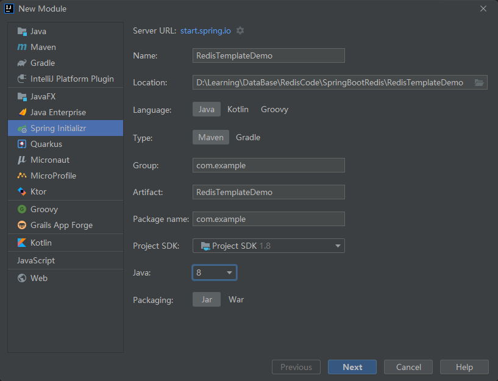
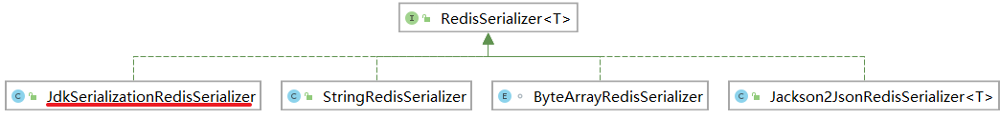

# 介绍

Spring Boot Data Redis中提供了`RedisTemplate`和`StringRedisTemplate`，其中*StringRedisTemplate*是*RedisTemplate*的子类，两个方法基本一致，不同之处主要体现在操作的==数据类型==不同。

- *RedisTemplate*中的两个泛型都是==Object==，意味着存储的key和value都可以是一个对象，会==自动序列化和反序列化==（<font color=red>向redis中存储的是对象的序列化</font>）。
- *StringRedisTemplate*的两个泛型都是==String==，意味着存储的key和value都只能是==字符串==。

注意：<font color=red>使用*RedisTemplate*默认是将对象序列化到*Redis*中了，所以放入的对象必须实现对象序列化接口</font>。

# 环境准备

## 使用Docker创建Redis

## 搭建项目



## 引入依赖

Added dependencies:

- Lombok
- Spring Web
- Spring Data Redis (Access+Driver)

```xml
<dependencies>
    <dependency>
        <groupId>org.springframework.boot</groupId>
        <artifactId>spring-boot-starter-data-redis</artifactId>
    </dependency>

    <dependency>
        <groupId>org.springframework.boot</groupId>
        <artifactId>spring-boot-starter-web</artifactId>
    </dependency>

    <dependency>
        <groupId>org.projectlombok</groupId>
        <artifactId>lombok</artifactId>
        <optional>true</optional>
    </dependency>

    <dependency>
        <groupId>org.springframework.boot</groupId>
        <artifactId>spring-boot-starter-test</artifactId>
        <scope>test</scope>
    </dependency>
</dependencies>
```

## 配置application.propertie

```properties
spring.redis.host=localhost
spring.redis.port=6379
spring.redis.database=0
```

# RedisTemplate

<font color=red>使用*RedisTemplate*默认是将*Object*（Key和Value都是Object）序列化到Redis中了！</font>

## 创建实现序列化接口的实体

创建`entity/User`；由于<font color=red>使用*RedisTemplate*默认是将对象序列化到Redis中了</font>，所以<font color=red>放入的对象必须实现对象序列化接口</font>。

```java
package com.example.entity;

import lombok.Data;
import lombok.experimental.Accessors;

import java.io.Serializable;
import java.util.Date;

/**
 * @author chenzufeng
 * @date 2021/10/27
 * @usage User 实现 Serializable
 * @Accessors(chain = true) 开启链式调用
 */
@Data
@Accessors(chain = true)
public class User implements Serializable {
    private String id;
    private String name;
    private Integer age;
    private Date birth;
}
```

## 使用redis存储实例对象

```java
package com.example;

import com.example.entity.User;
import org.junit.jupiter.api.Test;
import org.springframework.beans.factory.annotation.Autowired;
import org.springframework.boot.test.context.SpringBootTest;
import org.springframework.data.redis.core.RedisTemplate;

import java.util.Date;
import java.util.UUID;

/**
 * @author chenzufeng
 * @date 2021/10/27
 * @usage RedisTemplateTests
 */
@SpringBootTest(classes = RedisTemplateDemoApplication.class)
public class RedisTemplateTests {
    /**
     * 注入RedisTemplate（Key和Value都是Object）
     * 必须将对象序列化才能存入redis中
     */
    @Autowired
    private RedisTemplate redisTemplate;

    @Test
    public void testRedisTemplate() {
        User user = new User();
        // 链式调用
        user.setId(UUID.randomUUID().toString())
                .setName("zufeng")
                .setAge(28)
                .setBirth(new Date());
        redisTemplate.opsForValue().set("user", user);
        User user1 = (User) redisTemplate.opsForValue().get("user");
        System.out.println(user1);
    }
}
```

输出：

```markdown
User(id=b8d56570-30a2-403f-8563-d01066ceff23, name=zufeng, age=28, birth=Wed Oct 27 23:19:45 CST 2021)
```

### 修改Key序列化方案



如果将Key序列化存储至redis，则==无法在终端对Key进行操作==（如get、del）！

*RedisTemplate*对象中key和value的序列化都是`JdkSerializationRedisSerializer`：

```java
package com.example;

@SpringBootTest(classes = RedisTemplateDemoApplication.class)
public class RedisTemplateTests {
    /**
     * 注入RedisTemplate（Key和Value都是Object）
     * 必须将对象序列化才能存入redis中
     */
    @Autowired
    private RedisTemplate redisTemplate;
    
    @Test
    public void testKeySerializer() {
        RedisSerializer keySerializer = redisTemplate.getKeySerializer();
        System.out.println(keySerializer);
    }
}
```

输出：

```markdown
org.springframework.data.redis.serializer.JdkSerializationRedisSerializer@9f674ac
```


希望`Key：String；Value：Object`，因此需要修改Key的序列化策略（由Object改为String）

```java
package com.example;

@SpringBootTest(classes = RedisTemplateDemoApplication.class)
public class RedisTemplateTests {
    /**
     * 注入RedisTemplate（Key和Value都是Object）
     * 必须将对象序列化才能存入redis中
     */
    @Autowired
    private RedisTemplate redisTemplate;

    @Test
    public void testSetKeySerializer() {
        // 修改Key序列化方案：修改为String类型序列
        redisTemplate.setKeySerializer(new StringRedisSerializer());

        User user = new User();
        user.setId(UUID.randomUUID().toString())
                .setName("zufeng")
                .setAge(28)
                .setBirth(new Date());
        redisTemplate.opsForValue().set("user", user);
        User user1 = (User) redisTemplate.opsForValue().get("user");
        System.out.println(user1);

        // 查看所有的key
        Set keys = redisTemplate.keys("*");
        keys.forEach(key -> System.out.println(key));
    }
}
```

输出：

```markdown
User(id=b97d857e-87b9-48b5-9765-3a63662b5b01, name=zufeng, age=28, birth=Wed Oct 27 23:49:01 CST 2021)
�� t user
name
user
```


## 操作其他类型

下列操作只有一个key：

* redisTemplate.opsForList()
* redisTemplate.opsForSet()
* redisTemplate.opsForZSet()

```java
package com.example;

@SpringBootTest(classes = RedisTemplateDemoApplication.class)
public class RedisTemplateTests {
    /**
     * 注入RedisTemplate（Key和Value都是Object）
     * 必须将对象序列化才能存入redis中
     */
    @Autowired
    private RedisTemplate redisTemplate;

    @Test
    public void testOther() {
        // 修改Key序列化方案：修改为String类型序列
        redisTemplate.setKeySerializer(new StringRedisSerializer());

        User user = new User();
        user.setId(UUID.randomUUID().toString())
                .setName("zufeng")
                .setAge(28)
                .setBirth(new Date());
        
        // 下列操作只有一个key
        redisTemplate.opsForList().leftPush("userList", user);
        redisTemplate.opsForSet().add("userSet", user);
        redisTemplate.opsForZSet().add("userZSet", user, 100);
    }
}
```

### 修改hashKey序列化策略

`redisTemplate.opsForHash().put(Object key Object hashKey Object value)`：

`StringRedisSerializer`修改的是`key`，
`hashKey`使用的还是`JdkSerializationRedisSerializer`序列化！

```java
package com.example;

@SpringBootTest(classes = RedisTemplateDemoApplication.class)
public class RedisTemplateTests {
    /**
     * 注入RedisTemplate（Key和Value都是Object）
     * 必须将对象序列化才能存入redis中
     */
    @Autowired
    private RedisTemplate redisTemplate;

    @Test
    public void testSetHashKey() {
        // 修改Key序列化方案：修改为String类型序列
        redisTemplate.setKeySerializer(new StringRedisSerializer());
        // 修改hash key序列化策略
        redisTemplate.setHashKeySerializer(new StringRedisSerializer());

        User user = new User();
        user.setId(UUID.randomUUID().toString())
                .setName("zufeng")
                .setAge(28)
                .setBirth(new Date());
        
        redisTemplate.opsForHash().put("maps", "user", user);
    }
}
```

查看keys：

```markdown
127.0.0.1:6379> keys *
1) "maps"
```


